---
# Front matter
lang: ru-RU
title: "Лабораторная работа 2"
subtitle: "Управление версиями"
author: "Арина Олеговна Аристова"

# Formatting
toc-title: "Содержание"
toc: true # Table of contents
toc_depth: 2
fontsize: 12pt
linestretch: 1.5
papersize: a4paper
documentclass: scrreprt
polyglossia-lang: russian
polyglossia-otherlangs: english
mainfont: PT Serif
romanfont: PT Serif
sansfont: PT Sans
monofont: PT Mono
mainfontoptions: Ligatures=TeX
romanfontoptions: Ligatures=TeX
sansfontoptions: Ligatures=TeX,Scale=MatchLowercase
monofontoptions: Scale=MatchLowercase
indent: true
pdf-engine: lualatex
header-includes:
  - \linepenalty=10 # the penalty added to the badness of each line within a paragraph (no associated penalty node) Increasing the value makes tex try to have fewer lines in the paragraph.
  - \interlinepenalty=0 # value of the penalty (node) added after each line of a paragraph.
  - \hyphenpenalty=50 # the penalty for line breaking at an automatically inserted hyphen
  - \exhyphenpenalty=50 # the penalty for line breaking at an explicit hyphen
  - \binoppenalty=700 # the penalty for breaking a line at a binary operator
  - \relpenalty=500 # the penalty for breaking a line at a relation
  - \clubpenalty=150 # extra penalty for breaking after first line of a paragraph
  - \widowpenalty=150 # extra penalty for breaking before last line of a paragraph
  - \displaywidowpenalty=50 # extra penalty for breaking before last line before a display math
  - \brokenpenalty=100 # extra penalty for page breaking after a hyphenated line
  - \predisplaypenalty=10000 # penalty for breaking before a display
  - \postdisplaypenalty=0 # penalty for breaking after a display
  - \floatingpenalty = 20000 # penalty for splitting an insertion (can only be split footnote in standard LaTeX)
  - \raggedbottom # or \flushbottom
  - \usepackage{float} # keep figures where there are in the text
  - \floatplacement{figure}{H} # keep figures where there are in the text
---

# Цель работы

-Изучить идеологию и применение средств контроля версий.

-Освоить умения по работе с git.

# Задание

-Создать базовую конфигурацию для работы с git;

-Создать ключ SSH;

-Создать ключ PGP;

-Настроить подписи git;

-Зарегистрироваться на Github;

-Создать локальный каталог для выполнения заданий по предмету.

# Теоретическое введение

Системы контроля версий (Version Control System, VCS) применяются при работе нескольких человек над одним проектом. Обычно основное дерево проекта хранится в локальном
или удалённом репозитории, к которому настроен доступ для участников проекта. При
внесении изменений в содержание проекта система контроля версий позволяет их
фиксировать, совмещать изменения, произведённые разными участниками проекта,
производить откат к любой более ранней версии проекта, если это требуется.

В классических системах контроля версий используется централизованная модель,
предполагающая наличие единого репозитория для хранения файлов. Выполнение большинства функций по управлению версиями осуществляется специальным сервером.
Участник проекта (пользователь) перед началом работы посредством определённых
команд получает нужную ему версию файлов. После внесения изменений, пользователь
размещает новую версию в хранилище. При этом предыдущие версии не удаляются
из центрального хранилища и к ним можно вернуться в любой момент. Сервер может
сохранять не полную версию изменённых файлов, а производить так называемую дельтакомпрессию — сохранять только изменения между последовательными версиями, что
позволяет уменьшить объём хранимых данных.

Системы контроля версий поддерживают возможность отслеживания и разрешения
конфликтов, которые могут возникнуть при работе нескольких человек над одним
файлом. Можно объединить (слить) изменения, сделанные разными участниками (автоматически или вручную), вручную выбрать нужную версию, отменить изменения вовсе
или заблокировать файлы для изменения. В зависимости от настроек блокировка не
позволяет другим пользователям получить рабочую копию или препятствует изменению
рабочей копии файла средствами файловой системы ОС, обеспечивая таким образом,
привилегированный доступ только одному пользователю, работающему с файлом.

Системы контроля версий также могут обеспечивать дополнительные, более гибкие
функциональные возможности. Например, они могут поддерживать работу с несколькими версиями одного файла, сохраняя общую историю изменений до точки ветвления
версий и собственные истории изменений каждой ветви. Кроме того, обычно доступна
информация о том, кто из участников, когда и какие изменения вносил. Обычно такого
рода информация хранится в журнале изменений, доступ к которому можно ограничить.

В отличие от классических, в распределённых системах контроля версий центральный
репозиторий не является обязательным.
Среди классических VCS наиболее известны CVS, Subversion, а среди распределённых — Git, Bazaar, Mercurial. Принципы их работы схожи, отличаются они в основном
синтаксисом используемых в работе команд.

# Выполнение лабораторной работы

Предварительно создаю учетную запись и заполняю основные данные на https://github.com.
Устанавливаю git-flow в Fedora Linux.

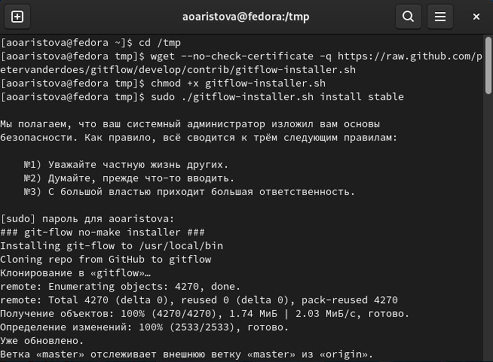{ #fig:001 width=70% }

Устанавливаю gh в Fedora Linux.

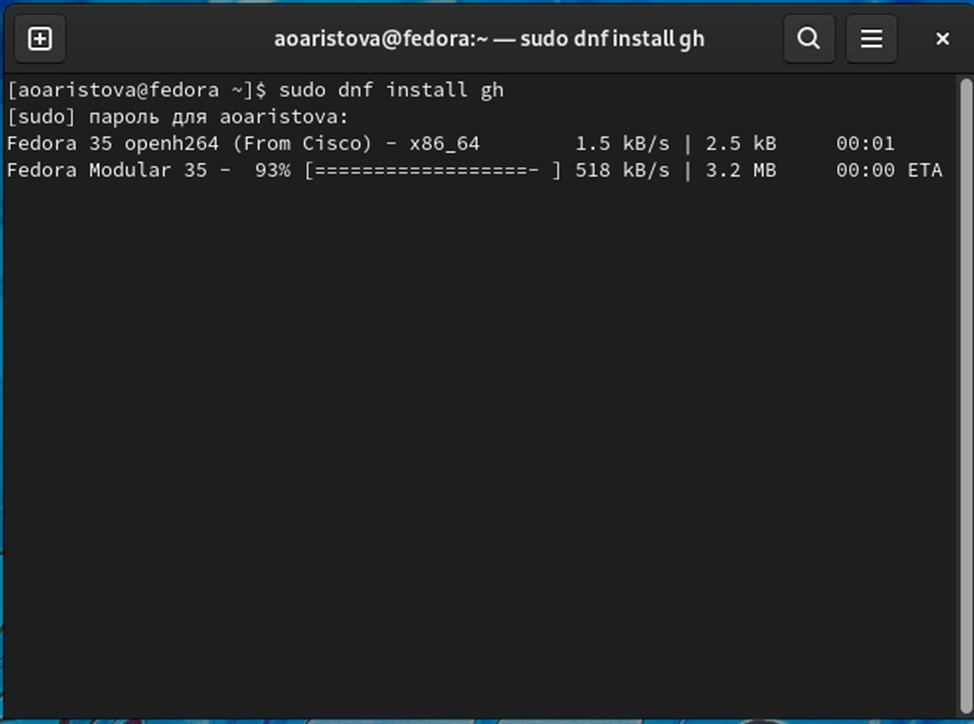{ #fig:002 width=70% }

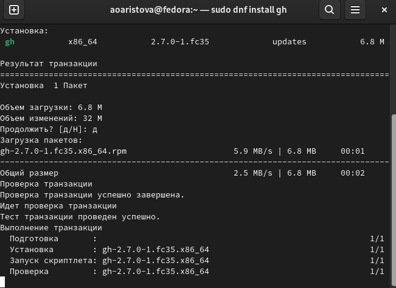{ #fig:003 width=70% }

Выполняю базовую настройку git.

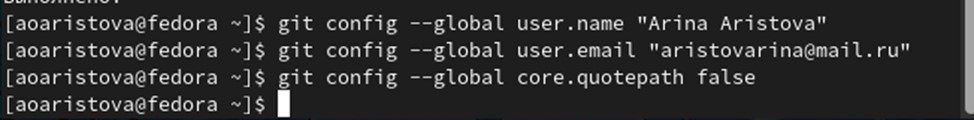{ #fig:004 width=70% }

Настраиваю utf-8 в выводе сообщений git

{ #fig:005 width=70% }

Настраиваю верификацию и подписание коммитов git. Задаю имя начальной ветки master, параметр autocrlf, параметр safecrlf.

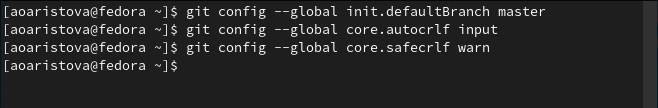{ #fig:006 width=70% }

Создаю ключи ssh:

-по алгоритму rsa с ключём размером 4096 бит;

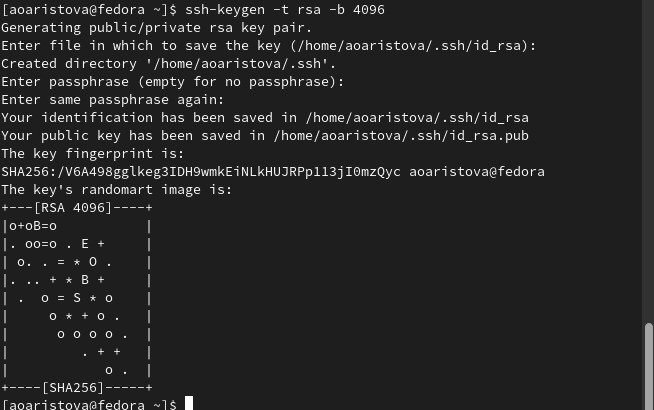{ #fig:007 width=70% }

- по алгоритму ed25519.

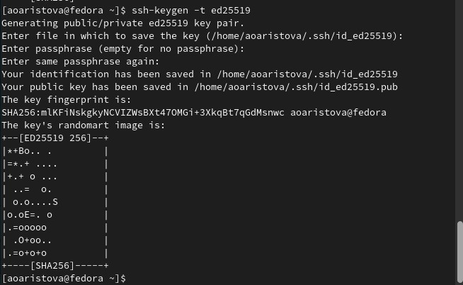{ #fig:008 width=70% }

Создаю ключ pgp. Генерирую ключ. Из предложенных опций выбираю: тип RSA and RSA; размер 4096; срок действия - 0 (срок действия не истекает никогда), примечание оставляю пустым.

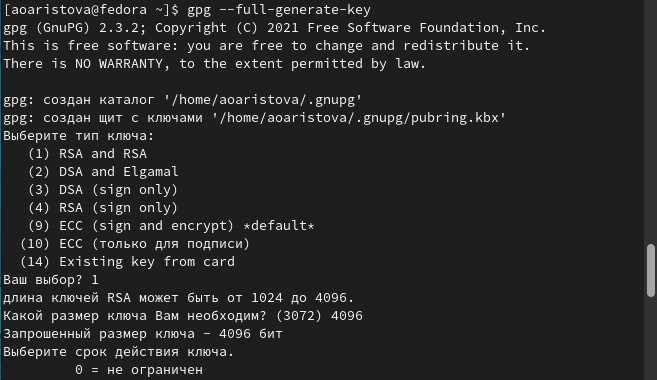{ #fig:009 width=70% }

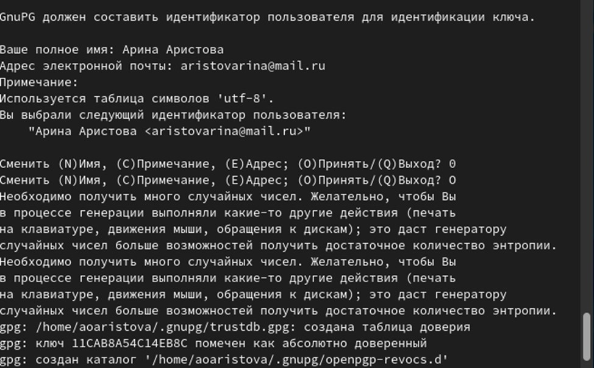{ #fig:010 width=70% }

Добавляю PGP ключ в GitHub:
Вывожу список ключей и копирую отпечаток приватного ключа.

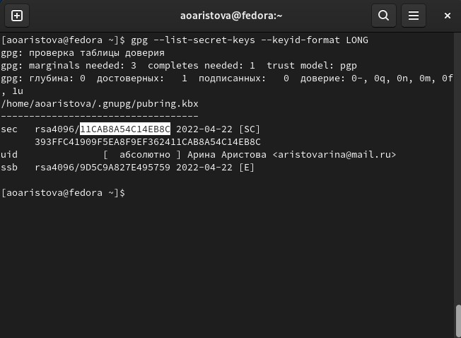{ #fig:011 width=70% }

Копирую сгенерированный PGP ключ в буфер обмена и вставляю полученный ключ в поле ввода в GitHub.

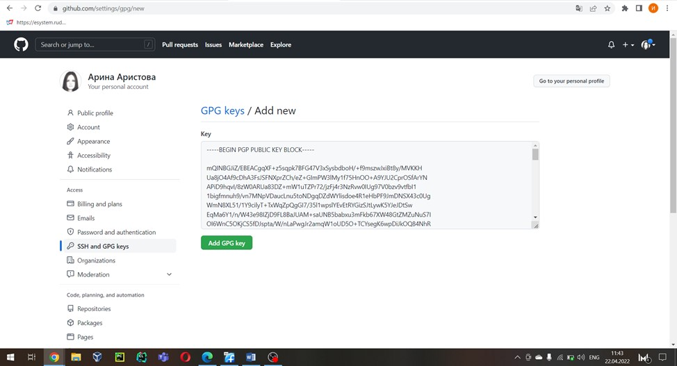{ #fig:012 width=70% }

Настраиваю автоматические подписи коммитов git. Используя введённый email, указываю Git применять его при подписи коммитов.

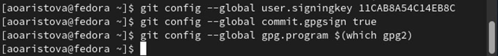{ #fig:013 width=70% }

Настраиваю gh: 
Авторизуюсь через браузер.

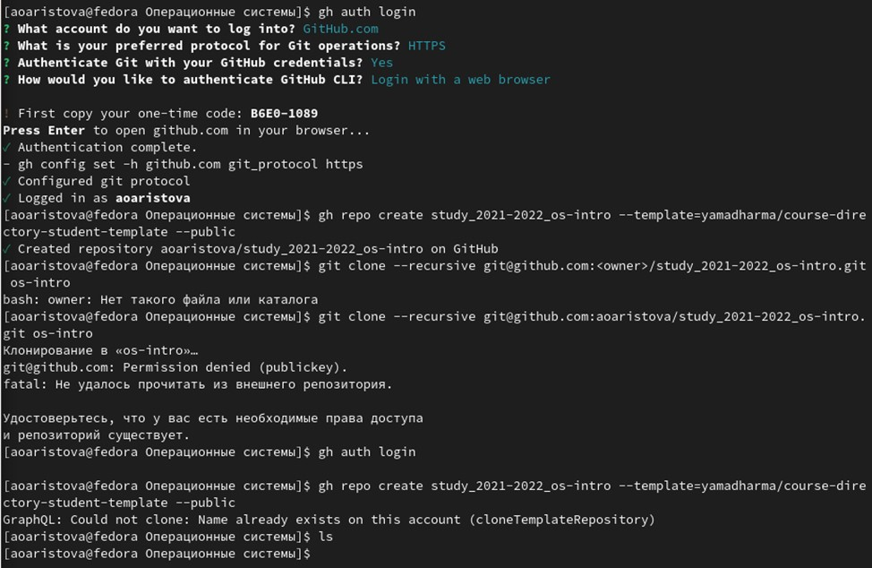{ #fig:014 width=70% }

Создаю репозиторий курса на основе шаблона.

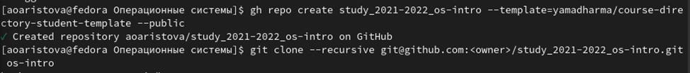{ #fig:015 width=70% }

{ #fig:016 width=70% }

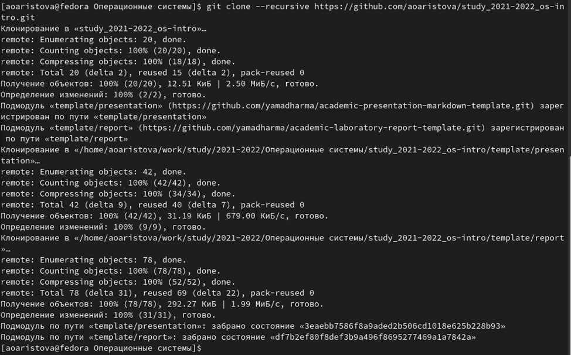{ #fig:017 width=70% }

Настраиваю каталога курса.
Перехожу в каталог курса, удаляю лишние файлы, создаю необходимые каталоги и отправляю файлы на сервер.

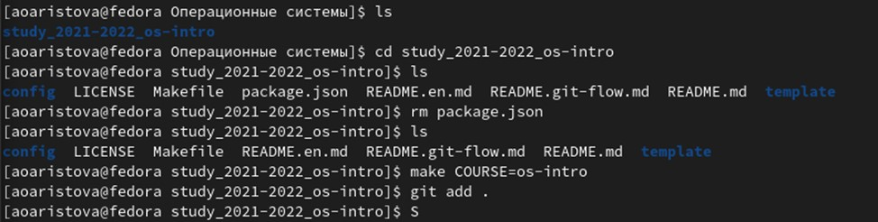{ #fig:018 width=70% }

# Вывод

я изучила идеологию применения средств контроля версий, а также освоила умения по работе с git. 

# Ответы на контрольные вопросы

1. Что такое системы контроля версий (VCS) и для решения каких задач они предназначаются?
VCS – (Version Control System) системы контроля версий. Они применяются при работе нескольких человек над одним проектом. Обычно основное дерево проекта хранится в локальном или удалённом репозитории, к которому настроен доступ для участников проекта. При внесении изменений в содержание проекта система контроля версий позволяет их фиксировать, совмещать изменения, произведённые разными участниками проекта, производить откат к любой более ранней версии проекта, если это требуется.

2. Объясните следующие понятия VCS и их отношения: хранилище, commit, история, рабочая копия.
Хранилище – место расположения файлов и папок проекта, изменения в которых отслеживаются.
Commit – операция, предполагающая отправку в репозиторий изменений, которые пользователь внес в свою рабочую копию.
Рабочая копия - текущее состояние файлов проекта, полученных из хранилища и, возможно, измененных, то есть разработчик имеет в распоряжении именно рабочую копию и с ней работает.

3. Что представляют собой и чем отличаются централизованные и децентрализованные VCS? Приведите примеры VCS каждого вида.
Централизованные VCS имеют одно основное хранилище. Каждый пользователь копирует себе необходимые файлы из основного репозитория, изменяет их, а затем добавляет изменения обратно (Subversion).
Децентрализованные VCS устроены так, что каждый пользователь имеет свой (или даже не один) репозиторий. Пользователь может добавлять и забирать изменения из любого репозитория (Git).
Соответственно, количеством основных репозиториев и различаются централизованные и децентрализованные VCS.

4. Опишите действия с VCS при единоличной работе с хранилищем.
Разработчик работает с веткой master, при необходимости может создать ветки для отдельных частей проекта. При завершении изменений разработчик коммитит (commit) и пушит (push) их, то есть сохраняет изменения в общем хранилище. 

5. Опишите порядок работы с общим хранилищем VCS.
Каждый разработчик проекта работает над отдельной часть проекта в своей ветке. После завершения изменений разработчик коммитит (commit) и пушит (push) изменения на сервер. После окончания работы необходимо смерджить(merge), то есть выполнить слияние, веток, например, с главной веткой. Также разработчик может работать с изменениями, сделанными другим разработчиком, если на одной ветке их работает несколько. 

6. Каковы основные задачи, решаемые инструментальным средством git?
Основные задачи git заключаются в удобной командной работе над проектом, а также в хранении информации обо всех изменениях проекта. 

7. Назовите и дайте краткую характеристику командам git.
git init – создание основного дерева репозитория;
git pull - получение обновлений (изменений) текущего дерева из центрального репозитория;
git push - отправка всех произведённых изменений локального дерева в центральный репозиторий;
git status - просмотр списка изменённых файлов в текущей директории;
git diff - просмотр текущих изменений;
git add - сохранение текущих изменений: добавить все изменённые и/или созданные файлы и/или каталоги;
git add имена_файлов - сохранение текущих изменений: добавить конкретные изменённые и/или созданные файлы и/или каталоги:  git rm имена_файлов - удалить файл и/или каталог из индекса репозитория (при этом файл и/или каталог остаётся в локальной директории);
git commit -am 'Описание коммита' - сохранение добавленных изменений:сохранить все добавленные изменения и все изменённые файлы;
git commit - сохранение добавленных изменений: сохранить добавленные изменения с внесением комментария через встроенный редактор;
git checkout -b имя_ветки - создание новой ветки, базирующейся на текущей;
git checkout имя_ветки - переключение на некоторую ветку;
git push origin имя_ветки - отправка изменений конкретной ветки в центральный репозиторий;
git merge --no-ff имя_ветки - слияние ветки с текущим деревом;
git branch -d имя_ветки - удаление локальной уже слитой с основным деревом ветки;
git branch -D имя_ветки - принудительное удаление локальной ветки;
git push origin :имя_ветки - удаление ветки с центрального репозитория. 

9. Что такое и зачем могут быть нужны ветви (branches)?
Ветка – указатель на один из коммитов. Ветки используются для разработки одной части проекта отдельно от других его частей. Каждая ветка представляет собой отдельную копию кода проекта. Ветки позволяют работать одновременно над разными версиями проекта.

10. Как и зачем можно игнорировать некоторые файлы при commit?
Игнорировать файлы при commit можно с помощью файла .gitignor . Туда обычно помещаются файлы, которые не нужны для проекта, например, временные файлы, создаваемые редакторами. 

