---
## Front matter
lang: ru-RU
title: Лабораторная работа 4
subtitle: Приобретение практических навыков взаимодействия пользователя с системой посредством командной строки 
author: |
	Аристова Арина Олеговна 
institute: |
	RUDN University, Moscow, Russian Federation
date: 2022, 29 April

## Formatting
toc: false
slide_level: 2
theme: metropolis
header-includes: 
 - \metroset{progressbar=frametitle,sectionpage=progressbar,numbering=fraction}
 - '\makeatletter'
 - '\beamer@ignorenonframefalse'
 - '\makeatother'
aspectratio: 43
section-titles: true
---

## Цель работы

Приобретение практических навыков взаимодействия пользователя с системой посредством командной строки.

## Задание

1. Определите полное имя вашего домашнего каталога. Далее относительно этого каталога будут выполняться последующие упражнения.

2. Выполните следующие действия:

       2.1. Перейдите в каталог /tmp.

       2.2. Выведите на экран содержимое каталога /tmp. 
Для этого используйте команду ls с различными опциями. 
Поясните разницу в выводимой на экран информации.

       2.3. Определите, есть ли в каталоге /var/spool 
подкаталог с именем cron?

## Задание

       2.4. Перейдите в Ваш домашний каталог и выведите на экран 
его содержимое. Определите, кто является владельцем файлов и подкаталогов?

3. Выполните следующие действия:

       3.1. В домашнем каталоге создайте новый каталог с именем 
newdir.

       3.2. В каталоге ~/newdir создайте новый каталог с именем 
morefun.

       3.3. В домашнем каталоге создайте одной командой три новых 
каталога с именами
letters, memos, misk. Затем удалите эти каталоги одной командой.

## Задание

       3.4. Попробуйте удалить ранее созданный каталог 
~/newdir командой rm. Проверьте, был ли каталог удалён.

       3.5. Удалите каталог ~/newdir/morefun из домашнего каталога. 
Проверьте, был ли каталог удалён.

4. С помощью команды man определите, какую опцию команды ls нужно использовать для просмотра содержимое не только указанного каталога, но и подкаталогов,
входящих в него.

## Задание

5. С помощью команды man определите набор опций команды ls, позволяющий отсортировать по времени последнего изменения выводимый список содержимого каталога
с развёрнутым описанием файлов.

6. Используйте команду man для просмотра описания следующих команд: cd, pwd, mkdir,
rmdir, rm. Поясните основные опции этих команд.

7. Используя информацию, полученную при помощи команды history, выполните модификацию и исполнение нескольких команд из буфера команд. 

## Теоретическое введение

Командная строка – пользовательский интерфейс, обеспечивающий взаимодействия пользователя с системой. 

Командой в операционной системе называется записанный по
специальным правилам текст (возможно с аргументами), представляющий собой указание на выполнение какой-либо функций (или действий) в операционной системе.
Обычно первым словом идёт имя команды, остальной текст — аргументы или опции,
конкретизирующие действие.
Общий формат команд можно представить следующим образом:
<имя_команды><разделитель><аргументы>

## Выполнение лабораторной работы

1. Определяю полное имя домашнего каталога, используя команду pwd.

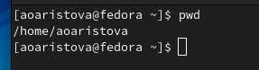{ #fig:001 width=70% }

## Выполнение лабораторной работы

2. Выполняю следующие действия:

	2.1. Перехожу в каталог /tmp.

	2.2. Вывожу на экран содержимое каталога /tmp. 
Для этого использую команду ls с различными опциями. 

Выполняю команду ls без дополнительных опций. На экран выводится информация о содержащихся в каталоге файлах и директориях. Выполняю команду ls –a и получаю дополнительно информацию о скрытых файлах и директориях.

## Выполнение лабораторной работы 

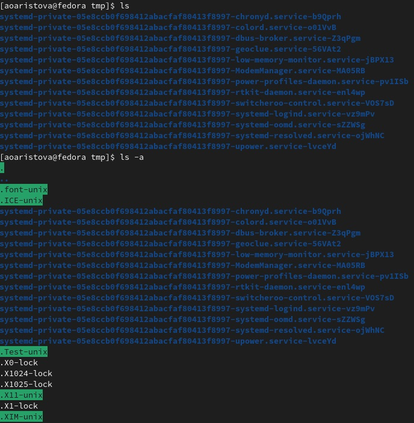{ #fig:002 width=50% }

## Выполнение лабораторной работы

Выполняю команду ls с другими опциями. В результате выполнения 
команды ls –F получаю информацию о типе файлов. 

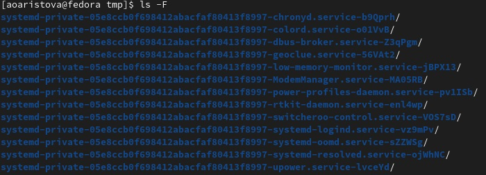{ #fig:003 width=70% }

## Выполнение лабораторной работы

В результате выполнения команды ls –l на экран выводится более 
подробная информация о файлах, содержащихся в директории, а именно:

-	тип файла;

-	права доступа;

-	число ссылок;

-	владелец;

-	размер;

-	дата последней ревизии;

-	имя файла или каталога.

## Выполнение лабораторной работы

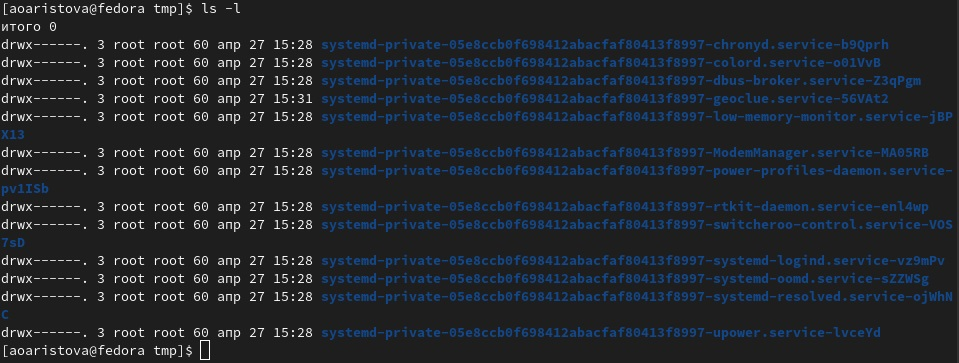{ #fig:004 width=70% }

## Выполнение лабораторной работы

2.3. Определяю, есть ли в каталоге /var/spool подкаталог с именем cron, 
используя для этого команду ls. Искомого католога по адресу /var/spool нет.

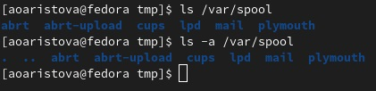{ #fig:005 width=70% }

## Выполнение лабораторной работы

2.4. Перехожу в домашний каталог и вывожу на экран его содержимое. С помощью 
команды ls с ключом l определяю, кто является владельцем файлов и подкаталогов.

{ #fig:006 width=70% }

## Выполнение лабораторной работы

3. Выполняю следующие действия:

	3.1. В домашнем каталоге командой mkdir создаю новый каталог с именем newdir.

       3.2. В каталоге ~/newdir создаю новый каталог с именем 
morefun.
       
       3.3. В домашнем каталоге создаю одной командой три новых 
каталога с именами letters, memos, misk. 
Убеждаюсь, что они созданы. Затем командой rmdir 
(так как каталоги пусты) удаляю эти каталоги одной командой. 
Убеждаюсь, что они были удалены.

## Выполнение лабораторной работы

       3.4. Пробую удалить ранее созданный каталог ~/newdir 
командой rm, однако этой командой без каких-либо опций 
удалить каталог нельзя.
       
       3.5. Удаляю каталог ~/newdir/morefun из домашнего каталога. 
Этот каталог также не был удален с помощью команды rm, поскольку 
она не удаляет каталоги, даже пустые. Однако с помощью команды rm с ключем r (rm –r) я рекурсивно удалила каталог ~/newdir. 
Затем я убедилась в удалении каталога. 

## Выполнение лабораторной работы

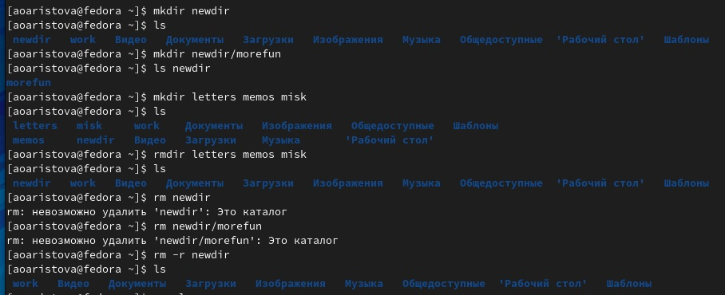{ #fig:007 width=100% }

## Выполнение лабораторной работы
	
4. С помощью команды man определяю, какую опцию команды ls нужно использовать для просмотра содержимого не только указанного каталога, но и подкаталогов, входящих в него, для этого используется опция R (ls –R), затем я проверяю работу этой команды.

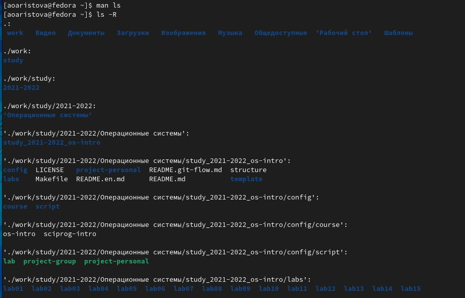{ #fig:008 width=50% }

## Выполнение лабораторной работы

С помощью команды man определяю опцию команды ls, позволяющую отсортировать по времени последнего изменения выводимый список содержимого каталога. Для этого служит опция t (ls -t). Чтобы проверить это также можно использовать команду с набором опций ls –tl, так как отобразится развёрнутое описание файлов, в том числе дата последней ревизии. Затем, выполняя команду ls без каких-либо опций, убеждаюсь, что директории в таком случае выводятся в ином порядке, чем при выполнении команды ls с опциями t и tl.

## Выполнение лабораторной работы

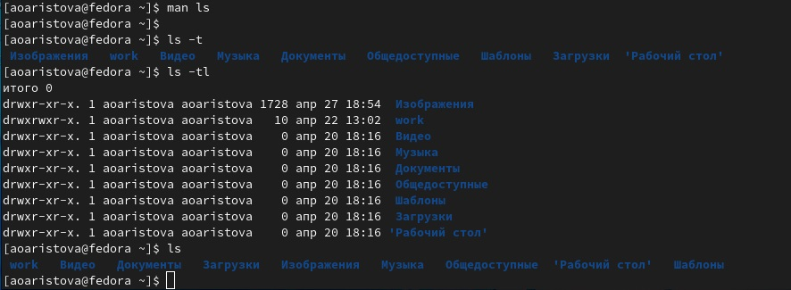{ #fig:009 width=70% }

## Выполнение лабораторной работы

Использую команду man для просмотра описания следующих команд: cd, pwd, mkdir, rmdir, rm. Поясняю основные опции этих команд. Привожу скриншоты выполнения пары из этих действий.

## Выполнение лабораторной работы

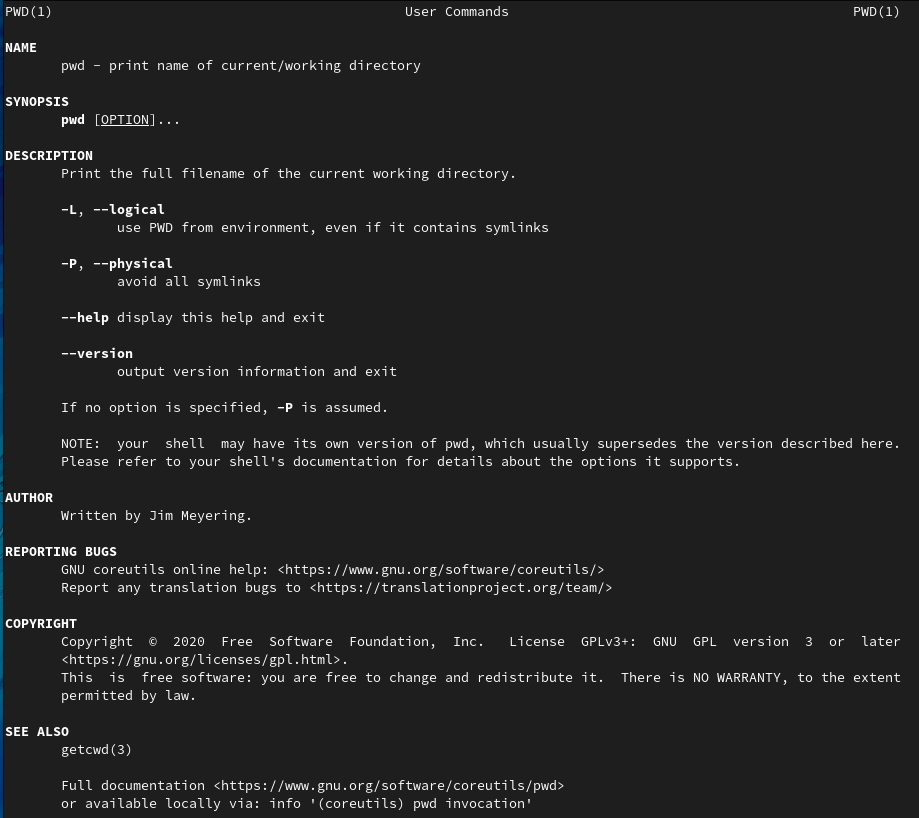{ #fig:010 width=70% }

## Выполнение лабораторной работы

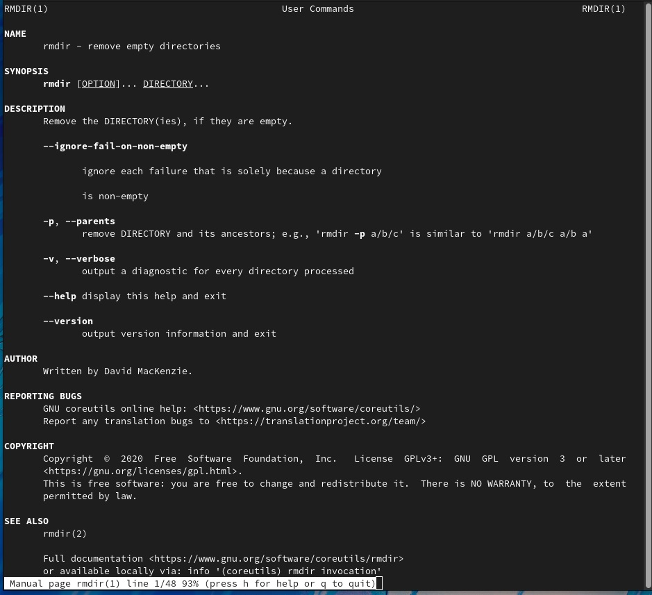{ #fig:011 width=70% }

## Выполнение лабораторной работы 

7. Используя информацию, полученную при помощи команды history, 
выполняю модификацию и исполнение нескольких команд из буфера команд, 
а именно команд под номерами 259, 269, 281.

## Выполнение лабораторной работы 

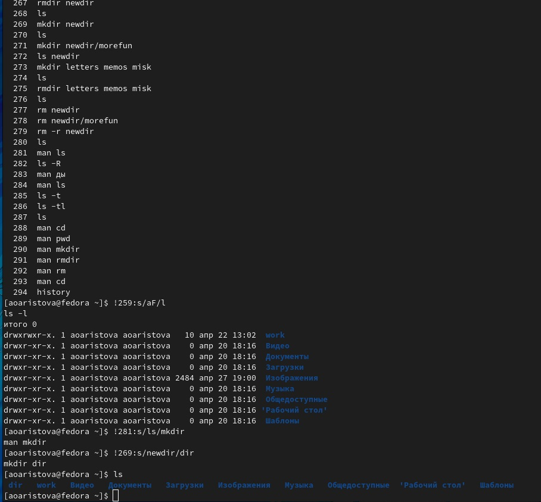{ #fig:012 width=70% }

## Вывод
	
В ходе лабораторной работы я приобрела практические навыки взаимодействия пользователя с системой посредством командной строки.
 

## Контрольные вопросы

Затем я ответила на контрольные вопросы к лабораторной работе и при необходимости привела примеры. 

