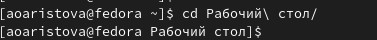

---
# Front matter
lang: ru-RU
title: "Лабораторная работа 4"
subtitle: "Приобретение практических навыков взаимодействия пользователя с системой посредством командной строки"
author: "Арина Олеговна Аристова"

# Formatting
toc-title: "Содержание"
toc: true # Table of contents
toc_depth: 2
fontsize: 12pt
linestretch: 1.5
papersize: a4paper
documentclass: scrreprt
polyglossia-lang: russian
polyglossia-otherlangs: english
mainfont: PT Serif
romanfont: PT Serif
sansfont: PT Sans
monofont: PT Mono
mainfontoptions: Ligatures=TeX
romanfontoptions: Ligatures=TeX
sansfontoptions: Ligatures=TeX,Scale=MatchLowercase
monofontoptions: Scale=MatchLowercase
indent: true
pdf-engine: lualatex
header-includes:
  - \linepenalty=10 # the penalty added to the badness of each line within a paragraph (no associated penalty node) Increasing the value makes tex try to have fewer lines in the paragraph.
  - \interlinepenalty=0 # value of the penalty (node) added after each line of a paragraph.
  - \hyphenpenalty=50 # the penalty for line breaking at an automatically inserted hyphen
  - \exhyphenpenalty=50 # the penalty for line breaking at an explicit hyphen
  - \binoppenalty=700 # the penalty for breaking a line at a binary operator
  - \relpenalty=500 # the penalty for breaking a line at a relation
  - \clubpenalty=150 # extra penalty for breaking after first line of a paragraph
  - \widowpenalty=150 # extra penalty for breaking before last line of a paragraph
  - \displaywidowpenalty=50 # extra penalty for breaking before last line before a display math
  - \brokenpenalty=100 # extra penalty for page breaking after a hyphenated line
  - \predisplaypenalty=10000 # penalty for breaking before a display
  - \postdisplaypenalty=0 # penalty for breaking after a display
  - \floatingpenalty = 20000 # penalty for splitting an insertion (can only be split footnote in standard LaTeX)
  - \raggedbottom # or \flushbottom
  - \usepackage{float} # keep figures where there are in the text
  - \floatplacement{figure}{H} # keep figures where there are in the text
---

# Цель работы

Приобретение практических навыков взаимодействия пользователя с системой посредством командной строки.
 
# Задание

Выполнить следующие действия:

1. Определите полное имя вашего домашнего каталога. Далее относительно этого каталога будут выполняться последующие упражнения.

2. Выполните следующие действия:

       2.1. Перейдите в каталог /tmp.

       2.2. Выведите на экран содержимое каталога /tmp. Для этого используйте команду ls
с различными опциями. Поясните разницу в выводимой на экран информации.

       2.3. Определите, есть ли в каталоге /var/spool подкаталог с именем cron?

       2.4. Перейдите в Ваш домашний каталог и выведите на экран его содержимое. 
Определите, кто является владельцем файлов и подкаталогов?

3. Выполните следующие действия:

       3.1. В домашнем каталоге создайте новый каталог с именем newdir.

       3.2. В каталоге ~/newdir создайте новый каталог с именем morefun.

       3.3. В домашнем каталоге создайте одной командой три новых каталога с именами
letters, memos, misk. Затем удалите эти каталоги одной командой.
       3.4. Попробуйте удалить ранее созданный каталог ~/newdir командой rm. Проверьте,
был ли каталог удалён.

       3.5. Удалите каталог ~/newdir/morefun из домашнего каталога. Проверьте, был ли 
каталог удалён.

4. С помощью команды man определите, какую опцию команды ls нужно использовать для просмотра содержимое не только указанного каталога, но и подкаталогов,
входящих в него.

5. С помощью команды man определите набор опций команды ls, позволяющий отсортировать по времени последнего изменения выводимый список содержимого каталога
с развёрнутым описанием файлов.

6. Используйте команду man для просмотра описания следующих команд: cd, pwd, mkdir,
rmdir, rm. Поясните основные опции этих команд.

7. Используя информацию, полученную при помощи команды history, выполните модификацию и исполнение нескольких команд из буфера команд. 

# Теоретическое введение

Командная строка – пользовательский интерфейс, обеспечивающий взаимодействия пользователя с системой. 

Командой в операционной системе называется записанный по
специальным правилам текст (возможно с аргументами), представляющий собой указание на выполнение какой-либо функций (или действий) в операционной системе.
Обычно первым словом идёт имя команды, остальной текст — аргументы или опции,
конкретизирующие действие.
Общий формат команд можно представить следующим образом:
<имя_команды><разделитель><аргументы>

# Выполнение лабораторной работы

1. Определяю полное имя домашнего каталога, используя команду pwd.

{ #fig:001 width=70% }

2. Выполняю следующие действия:
	2.1. Перехожу в каталог /tmp.
	2.2. Вывожу на экран содержимое каталога /tmp. 
Для этого использую команду ls с различными опциями. 

Выполняю команду ls без дополнительных опций. На экран выводится информация о содержащихся в каталоге файлах и директориях. Выполняю команду ls –a и получаю дополнительно информацию о скрытых файлах и директориях.

{ #fig:002 width=70% }

Выполняю команду ls с другими опциями. В результате выполнения 
команды ls –F получаю информацию о типе файлов. 

{ #fig:003 width=70% }

В результате выполнения команды ls –l на экран выводится более 
подробная информация о файлах, содержащихся в директории, а именно:

-	тип файла;

-	права доступа;

-	число ссылок;

-	владелец;

-	размер;

-	дата последней ревизии;

-	имя файла или каталога.

{ #fig:004 width=70% }

	2.3. Определяю, есть ли в каталоге /var/spool подкаталог с именем cron, 
используя для этого команду ls. Искомого католога по адресу /var/spool нет.

{ #fig:005 width=70% }

	2.4. Перехожу в домашний каталог и вывожу на экран его содержимое. С помощью 
команды ls с ключом l определяю, кто является владельцем файлов и подкаталогов.

{ #fig:006 width=70% }

3. Выполняю следующие действия:
	3.1. В домашнем каталоге командой mkdir создаю новый каталог с именем newdir.

       3.2. В каталоге ~/newdir создаю новый каталог с именем morefun.
       
       3.3. В домашнем каталоге создаю одной командой три новых 
каталога с именами letters, memos, misk. 
Убеждаюсь, что они созданы. Затем командой rmdir 
(так как каталоги пусты) удаляю эти каталоги одной командой. 
Убеждаюсь, что они были удалены.
       
       3.4. Пробую удалить ранее созданный каталог ~/newdir 
командой rm, однако этой командой без каких-либо опций 
удалить каталог нельзя.
       
       3.5. Удаляю каталог ~/newdir/morefun из домашнего каталога. 
Этот каталог также не был удален с помощью команды rm, поскольку 
она не удаляет каталоги, даже пустые. Однако с помощью команды rm с ключем r (rm –r) я рекурсивно удалила каталог ~/newdir. 
Затем я убедилась в удалении каталога. 

{ #fig:007 width=70% }

4. С помощью команды man определяю, какую опцию команды ls нужно использовать для просмотра содержимого не только указанного каталога, но и подкаталогов, входящих в него, для этого используется опция R (ls –R), затем я проверяю работу этой команды.

{ #fig:008 width=70% }

5. С помощью команды man определяю опцию команды ls, позволяющую отсортировать по времени последнего изменения выводимый список содержимого каталога. Для этого служит опция t (ls -t). Чтобы проверить это также можно использовать команду с набором опций ls –tl, так как отобразится развёрнутое описание файлов, в том числе дата последней ревизии. Затем, выполняя команду ls без каких-либо опций, убеждаюсь, что директории в таком случае выводятся в ином порядке, чем при выполнении команды ls с опциями t и tl.

{ #fig:009 width=70% }

6. Использую команду man для просмотра описания следующих команд: cd, pwd, mkdir, rmdir, rm. Поясните основные опции этих команд. Привожу скриншоты выполнения пары из этих действий.

{ #fig:010 width=70% }

{ #fig:011 width=70% }

Основные опции команды cd:
       -L: переходить по символическим ссылкам. Данное поведение используется по умолчанию.
       
       -P: разыменовывать символические ссылки. В данном случае, 
если осуществляется переход на символическую ссылку, которая 
указывает на директорию, то в результате команда cd изменит текущую рабочую директорию на директорию, указанную в качестве параметра 
(то есть ссылка будет разыменована).
       
Основные опции команды pwd:

       --version: показать версию утилиты pwd.
       
       -P или –physicаl: преобразовывать символические ссылки в 
исходные имена. Если путь содержит символические ссылки, то они 
будут преобразованы в названия исходных директорий, на которые они указывают.
       
Основные опции команды mkdir:

       -p или –pаrents: создать все директории, которые указаны 
внутри пути. Если какая-либо директория существует, то предупреждение 
об этом не выводится.
       
       -v или –verbose: выводить сообщение о каждой создаваемой директории. 
       
       --version: показать версию утилиты mkdir

Основные опции команды rm:

       -f или –force: игнорировать несуществующие файлы и аргументы. Никогда не выдавать 
запросы на подтверждение удаления.
       
       -i: выводить запрос на подтверждение удаления каждого файла.
       
       -I: выдать один запрос на подтверждение удаления всех файлов, 
если удаляется больше трех файлов или используется рекурсивное 
удаление. Опция применяется, как более «щадящая» версия опции –i.
       
       -r или -R или –recursive: рекурсивное удаление директорий и их содержимого.
       
       -d или –dir: удалять пустые директории.
       
       -v или –verbose: выводить информацию об удаляемых файлах.
       
Основные опции команды rmdir:

       -p: каждый аргумент каталога обрабатывается как путь, 
из которого будут удалены все компоненты, если они уже пусты, 
начиная с последнего компонента.
       
       -v, --verbose: отобразить подробную информацию для каждого обрабатываемого 
каталога.
       
       --version: показать информации о версии утилиты rmdir.

7. Используя информацию, полученную при помощи команды history, 
выполняю модификацию и исполнение нескольких команд из буфера команд, 
а именно команд под номерами 259, 269, 281.

{ #fig:012 width=70% }

# Вывод

В ходе лабораторной работы я приобрела практические навыки взаимодействия пользователя с системой посредством командной строки.

# Ответы на контрольные вопросы

1. Что такое командная строка?

Командная строка – пользовательский интерфейс, обеспечивающий взаимодействия пользователя с системой. 

2. При помощи какой команды можно определить абсолютный путь текущего каталога? Приведите пример.

Абсолютный путь текущего каталога определяется с помощью команды pwd. 

{ #fig:013 width=70% }

3. При помощи какой команды и каких опций можно определить только тип файлов и их имена в текущем каталоге? Приведите примеры.

Тип файлов и их имена можно узнать с помощью команды ls с опцией –F. 
Типы файлов:

/ - каталог

 - исполняемый файл

@ - ссылка

{ #fig:014 width=70% }

4. Каким образом отобразить информацию о скрытых файлах? Приведите примеры.

Информацию о скрытых файлах можно отобразить с помощью команды ls –a. имена таких файлов начинаются с точки. С помощью команды ls –aF я получила информацию о типе файлов, в том числе скрытых. А, использовав команду ls –aFl, я получила более подробную информацию об этих файлах. 

{ #fig:015 width=70% }

5. При помощи каких команд можно удалить файл и каталог? Можно ли это сделать одной и той же командой? Приведите примеры.

Файл удаляется с помощью команды rm. При указании опции –r можно рекурсивно удалить каталог вместе с содержимым. Если каталог пуст, то можно использовать команду rmdir. Так же необходимо использовать опцию –i для требования запроса на подтверждение на удаление файла. 

{ #fig:016 width=70% }

6. Каким образом можно вывести информацию о последних выполненных пользователем командах?

Информацию о последних выполненных командах можно получить, введя команду history.

{ #fig:017 width=70% }

7. Как воспользоваться историей команд для их модифицированного выполнения? Приведите примеры.

Для модифицированного выполнения команд из истории можно при помощи следующей конструкции: !<номер_команды>:s/<что_меняем>/<на_что_меняем>

{ #fig:018 width=70% }

8. Приведите примеры запуска нескольких команд в одной строке.

{ #fig:019 width=70% }

9. Дайте определение и приведите примеры символов экранирования.

Если в заданном контексте встречаются специальные символы (типа «.»,
«/», «*» и т.д.), надо перед ними поставить символ экранирования \ (обратный слэш).

{ #fig:020 width=70% }

10. Охарактеризуйте вывод информации на экран после выполнения команды ls с опцией l.

В результате выполнения команды ls –l на экран выводится следующая информация о файлах и директориях: 

-	тип файла;

-	права доступа;

-	число ссылок;

-	владелец;

-	размер;

-	дата последней ревизии;

-	имя файла или каталога.

11. Что такое относительный путь к файлу? Приведите примеры использования относительного и абсолютного пути при выполнении какой-либо команды.

Относительный путь к файлу – путь, начинающийся от текущей директории.

{ #fig:021 width=70% }

12. Как получить информацию об интересующей вас команде?

Информацию об интересующей команде можно получить с помощью команды man в формате man <команда>.

{ #fig:022 width=70% }

{ #fig:023 width=70% }

13. Какая клавиша или комбинация клавиш служит для автоматического дополнения вводимых команд?

Клавиша Tab служит для автоматического дополнения вводимых команд.
