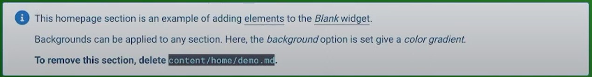

---
## Front matter
lang: ru-RU
title: Индивидуальный проект
subtitle: Этап 1
author: |
	A.O. Aristova
institute: |
	RUDN University, Moscow, Russian Federation
date: 2022, 30 April

## Formatting
toc: false
slide_level: 2
theme: metropolis
header-includes: 
 - \metroset{progressbar=frametitle,sectionpage=progressbar,numbering=fraction}
 - '\makeatletter'
 - '\beamer@ignorenonframefalse'
 - '\makeatother'
aspectratio: 43
section-titles: true
---

## Цель работы

Размещение на Github pages заготовки для персонального сайта.

## Выполнение лабораторной работы
 
На этапе предварительной подготовки я скачала исполняемый файл hugo и поместила его в ~/bin.

{ #fig:001 width=70% }

## Выполнение лабораторной работы

Создаю репозиторий blog на основе заданного шаблона.

{ #fig:002 width=70% }

## Выполнение лабораторной работы

Клонирую репозиторий blog.

{ #fig:003 width=60% }

## Выполнение лабораторной работы

Выполняю ~bin/hugo и удаляю пока ненужный каталог public.

{ #fig:004 width=60% }

## Выполнение работы

{ #fig:005 width=60% }

## Выполнение лабораторной работы

Выполняю команду ~bin/hugo server. 

{ #fig:006 width=70% }

Получаю ссылку и просматриваю её содержимое. 

## Выполнение лабораторной работы

{ #fig:007 width=60% }

## Выполнение лабораторной работы

Чтобы исчезло зеленое предупреждение, удаляю файл, указанный в этом предупреждении.

{ #fig:008 width=60% }

{ #fig:009 width=50% }

## Выполнение лабораторной работы

Создаю репозиторий с названием формата имя_пользователя.github.io, в моем случае aoaristova.github.io.

{ #fig:010 width=50% }

## Выполнение лабораторной работы

Захожу в каталог, в котором находится blog, в моем случае, это каталог work. В этом каталоге, содержащем blog, клонирую новый созданный репозиторий. В каталоге aoaristova.github.io выполняю команду git checkout –b main, создаю ветку main.
Затем создаю пустой файл README.md для активации репозитория.

{ #fig:011 width=50% }

## Выполнение лабораторной работы

git add .

git commit –am “add README.md”

git push origin main

{ #fig:012 width=70% }

## Выполнение лабораторной работы

Проверяю, что README.md появился в репозитории.

Затем подключаю созданный репозиторий к директории public внутри blog, это необходимо для эффективного генерирования страниц сайта. 

На экране появляется сообщение о том, что директории с названием public игнорируются .gitignore. Закомментировала public в .gitignore, таким образом данная проблема больше не возникнет. Проверяю эти изменения с помощью команды cat .gitignore. Затем вновь повторяю команду, которая привела к данному предупреждению.

## Выполнение лабораторной работы

{ #fig:013 width=70% }

## Выполнение лабораторной работы

В каталоге blog выполняю ~/bin/hugo. В каталоге public автоматически появляются файлы.

{ #fig:014 width=70% }

## Выполнение лабораторной работы

Затем необходимо синхронизировать файлы с репозиторием.
Выполнив команду git remote –v в каталоге public, убеждаюсь, что каталог public подключен к репозиторию.

{ #fig:015 width=80% }

## Выполнение лабораторной работы

git add .

git commit –am “add README.md”

git push origin main

{ #fig:016 width=90% }

## Выполнение лабораторной работы

{ #fig:017 width=100% }

## Выполнение лабораторной работы

Затем я проверяю изменения и открываю сайт.

{ #fig:018 width=70% }

## Вывод

Я разместила на Github pages заготовки для персонального сайта.

