---
# Front matter
lang: ru-RU
title: "Индивидуальный проект"
subtitle: "Этап 1"
author: "Арина Олеговна Аристова"

# Formatting
toc-title: "Содержание"
toc: true # Table of contents
toc_depth: 2
fontsize: 12pt
linestretch: 1.5
papersize: a4paper
documentclass: scrreprt
polyglossia-lang: russian
polyglossia-otherlangs: english
mainfont: PT Serif
romanfont: PT Serif
sansfont: PT Sans
monofont: PT Mono
mainfontoptions: Ligatures=TeX
romanfontoptions: Ligatures=TeX
sansfontoptions: Ligatures=TeX,Scale=MatchLowercase
monofontoptions: Scale=MatchLowercase
indent: true
pdf-engine: lualatex
header-includes:
  - \linepenalty=10 # the penalty added to the badness of each line within a paragraph (no associated penalty node) Increasing the value makes tex try to have fewer lines in the paragraph.
  - \interlinepenalty=0 # value of the penalty (node) added after each line of a paragraph.
  - \hyphenpenalty=50 # the penalty for line breaking at an automatically inserted hyphen
  - \exhyphenpenalty=50 # the penalty for line breaking at an explicit hyphen
  - \binoppenalty=700 # the penalty for breaking a line at a binary operator
  - \relpenalty=500 # the penalty for breaking a line at a relation
  - \clubpenalty=150 # extra penalty for breaking after first line of a paragraph
  - \widowpenalty=150 # extra penalty for breaking before last line of a paragraph
  - \displaywidowpenalty=50 # extra penalty for breaking before last line before a display math
  - \brokenpenalty=100 # extra penalty for page breaking after a hyphenated line
  - \predisplaypenalty=10000 # penalty for breaking before a display
  - \postdisplaypenalty=0 # penalty for breaking after a display
  - \floatingpenalty = 20000 # penalty for splitting an insertion (can only be split footnote in standard LaTeX)
  - \raggedbottom # or \flushbottom
  - \usepackage{float} # keep figures where there are in the text
  - \floatplacement{figure}{H} # keep figures where there are in the text
---

# Цель работы

Размещение на Github pages заготовки для персонального сайта.

# Задание

-Установить необходимое программное обеспечение.

-Скачать шаблон темы сайта.

-Разместить его на хостинге git.

-Установить параметр для URLs сайта.

-Разместить заготовку сайта на Github pages.

# Выполнение лабораторной работы

На этапе предварительной подготовки я скачала исполняемый файл hugo и поместила его в ~/bin.

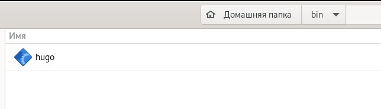{ #fig:001 width=70% }

Создаю репозиторий blog на основе заданного шаблона.

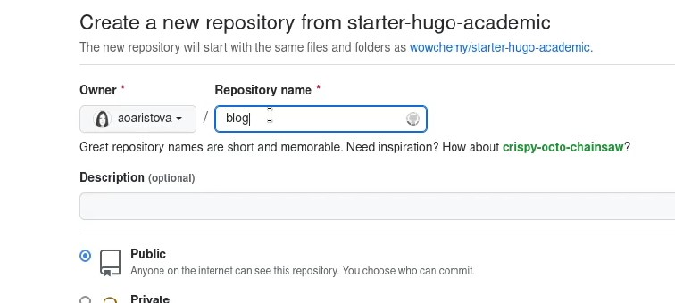{ #fig:002 width=70% }

Клонирую репозиторий blog.

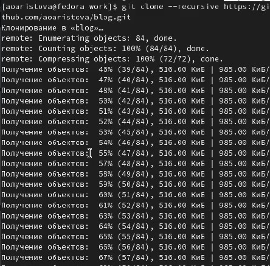{ #fig:003 width=70% }

Выполняю ~bin/hugo и удаляю пока ненужный каталог public.

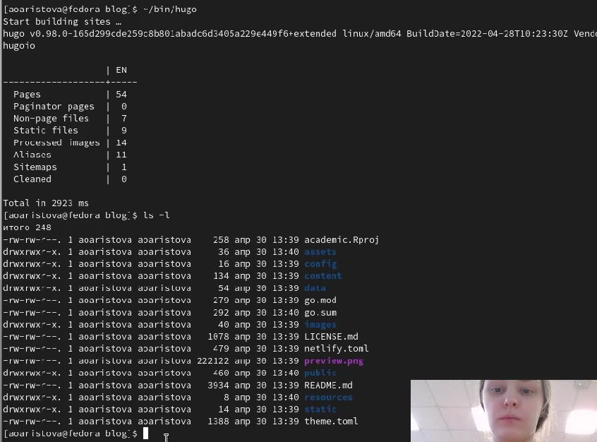{ #fig:004 width=70% }

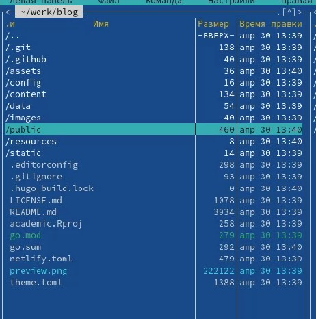{ #fig:005 width=70% }

Выполняю команду ~bin/hugo server. 

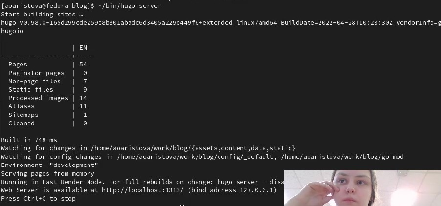{ #fig:006 width=70% }

Получаю ссылку и просматриваю её содержимое. 

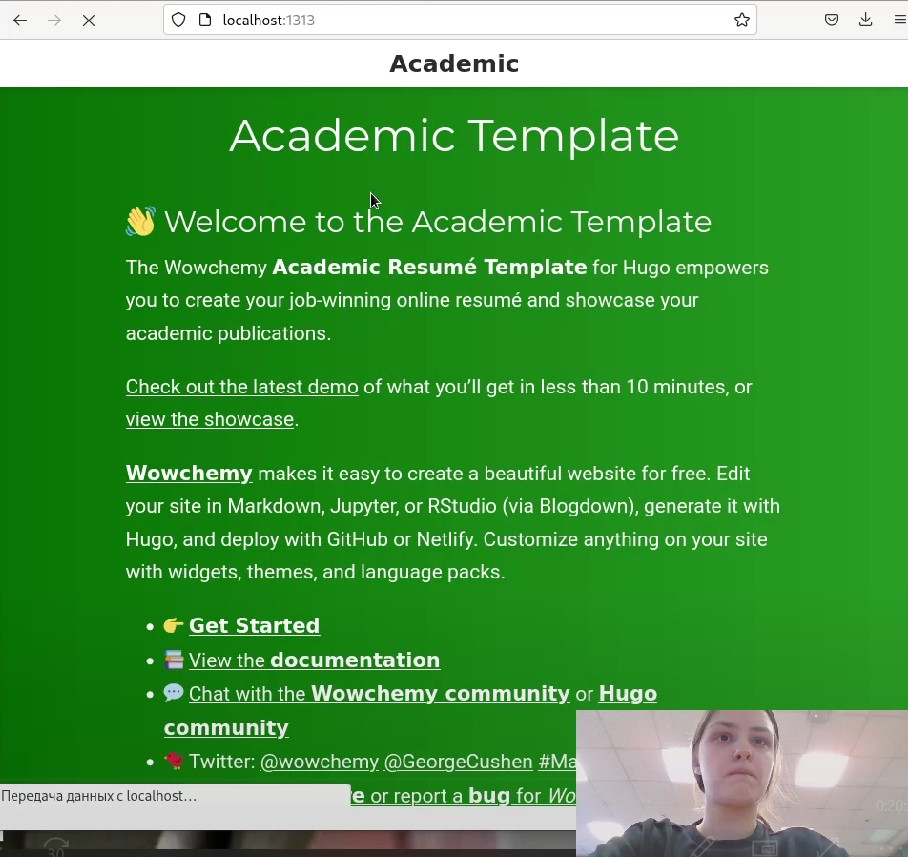{ #fig:007 width=70% }

Чтобы исчезло зеленое предупреждение, удаляю файл, указанный в этом предупреждении.

{ #fig:008 width=70% }

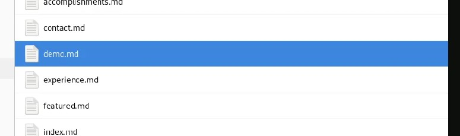{ #fig:009 width=70% }

Переношу сайт на репозиторий, чтобы сайт мог просматриваться не только с локального компьютера.

Создаю репозиторий с названием формата имя_пользователя.github.io, в моем случае aoaristova.github.io.

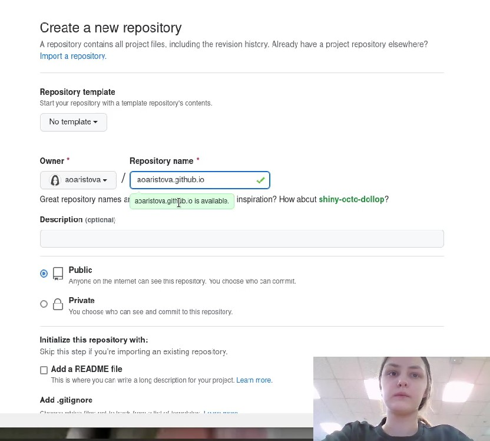{ #fig:010 width=70% }

Захожу в каталог, в котором находится blog, в моем случае, это каталог work. В этом каталоге, содержащем blog, клонирую новый созданный репозиторий. В каталоге aoaristova.github.io выполняю команду git checkout –b main, создаю ветку main.
Затем создаю пустой файл README.md для активации репозитория.

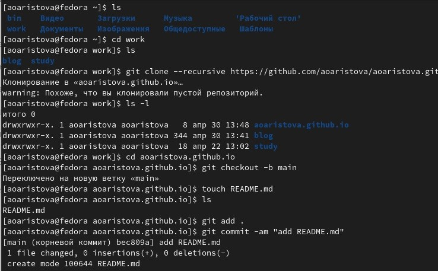{ #fig:011 width=70% }

Затем выполняю известные команды:

git add .
git commit –am “add README.md”
git push origin main

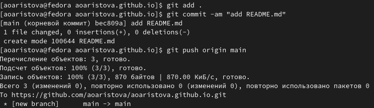{ #fig:012 width=70% }

Проверяю, что README.md появился в репозитории.

Затем подключаю созданный репозиторий к директории public внутри blog, это необходимо для эффективного генерирования страниц сайта. 

На экране появляется сообщение о том, что директории с названием public игнорируются .gitignore. Закомментировала public в .gitignore, таким образом данная проблема больше не возникнет. Проверяю эти изменения с помощью команды cat .gitignore. Затем вновь повторяю команду, которая привела к данному предупреждению.

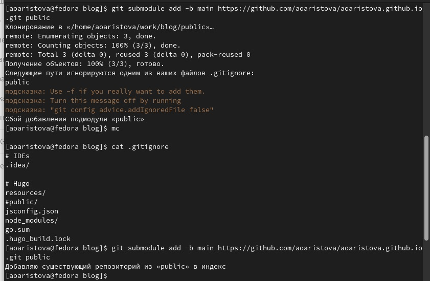{ #fig:013 width=70% }

В каталоге blog выполняю ~/bin/hugo. В каталоге public автоматически появляются файлы.

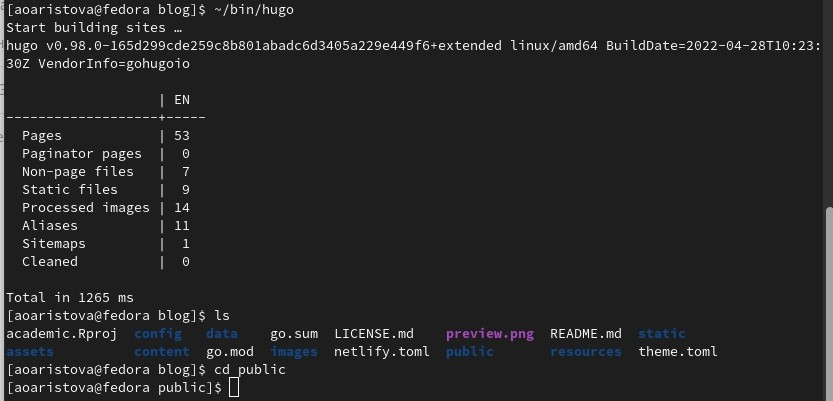{ #fig:014 width=70% }

Затем необходимо синхронизировать файлы с репозиторием.
Выполнив команду git remote –v в каталоге public, убеждаюсь, что каталог public подключен к репозиторию.

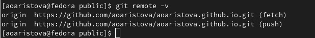{ #fig:015 width=70% }

Затем выполняю известные команды:

git add .
git commit –am “add README.md”
git push origin main

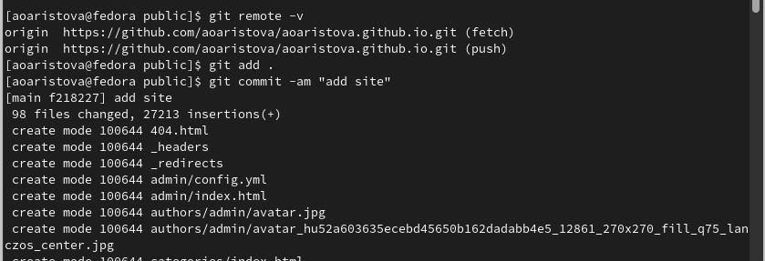{ #fig:016 width=70% }

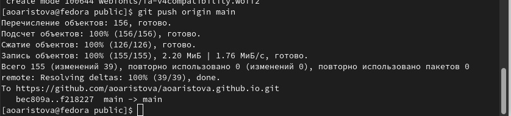{ #fig:017 width=70% }

Затем я проверяю изменения и открываю сайт.

{ #fig:018 width=70% }

# Вывод

Я разместила на Github pages заготовки для персонального сайта.
