---
## Front matter
lang: ru-RU
title: Индивидуальный проект
subtitle: Этап 2
author: |
	A.O. Aristova
institute: |
	RUDN University, Moscow, Russian Federation
date: 2022, 7 May

## Formatting
toc: false
slide_level: 2
theme: metropolis
header-includes: 
 - \metroset{progressbar=frametitle,sectionpage=progressbar,numbering=fraction}
 - '\makeatletter'
 - '\beamer@ignorenonframefalse'
 - '\makeatother'
aspectratio: 43
section-titles: true
---

## Цель работы

Добавить к сайту данные о себе, а также разместить несколько постов.

## Задание

Разместить фотографию владельца сайта.

Разместить краткое описание владельца сайта (Biography).

Добавить информацию об интересах (Interests).

Добавить информацию об образовании (Education).

Сделать пост по прошедшей неделе.

Добавить пост на тему по выбору:

       - Управление версиями. Git.
       
       - Непрерывная интеграция и непрерывное развертывание (CI/CD).

## Выполнение работы 

1. Размещаю фотографию владельца сайта, для этого заменяю фото из шаблона на свое:

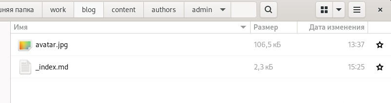{ #fig:001 width=70% }

## Выполнение работы 

2. Размещаю основную информацию: мое имя, название университета и ссылка на сайт:

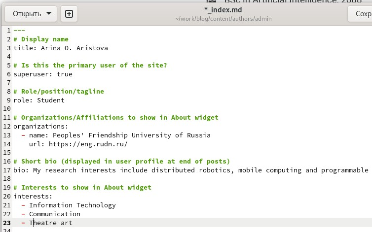{ #fig:002 width=70% }

## Выполнение работы 

Размещаю краткое описание владельца сайта (Biography): 

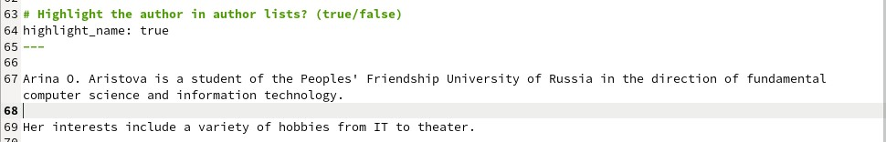{ #fig:003 width=90% }

## Выполнение работы 

Добавляю информацию об интересах (Interests)и об образовании (Education):

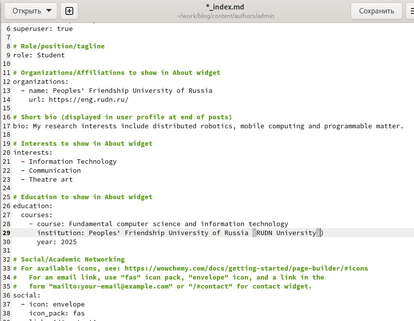{ #fig:004 width=70% }

## Выполнение работы 

Получив ссылку на локальный сайт с помощью ~/bin/hugo server, проверяю изменения содержимого:

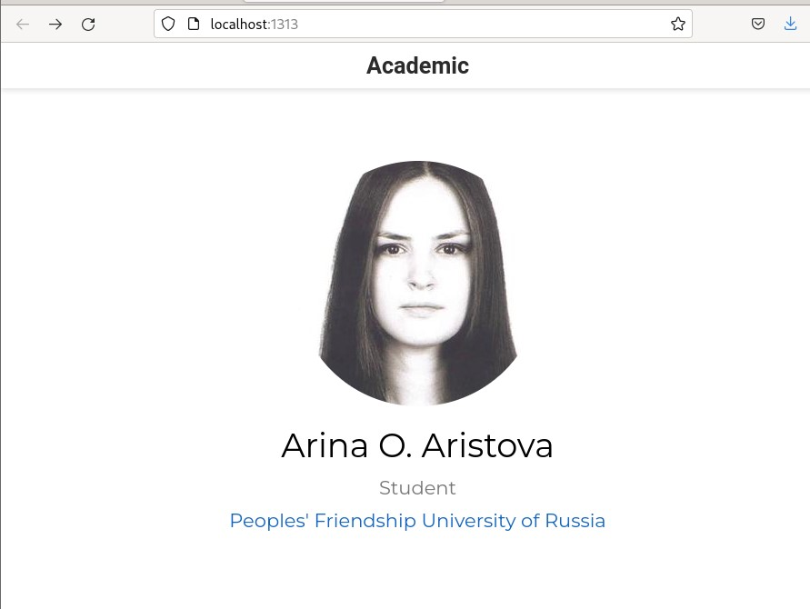{ #fig:005 width=70% }

## Выполнение работы 

3. Создаю пост о прошедшей неделе, размещая необходимую информацию:

Для этого выполняю команду ~/bin/hugo new post/last_week и заполняю пост информацией:

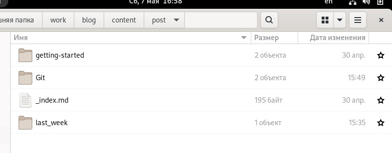{ #fig:006 width=70% }

## Выполнение работы 

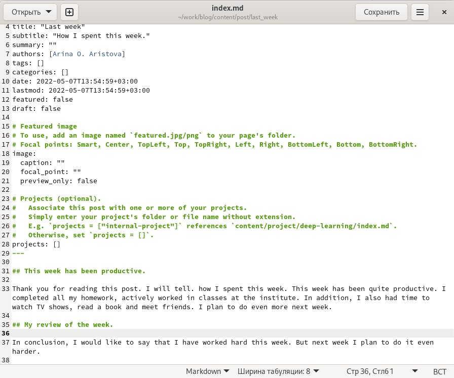{ #fig:007 width=70% }

## Выполнение работы 

4. Затем создаю пост на тему “Управление версиями. Git”:

Аналогично пункту 3 выполняю команду ~/bin/hugo new post/Git и заполняю пост информацией, к этому посту я добавила также изображение:

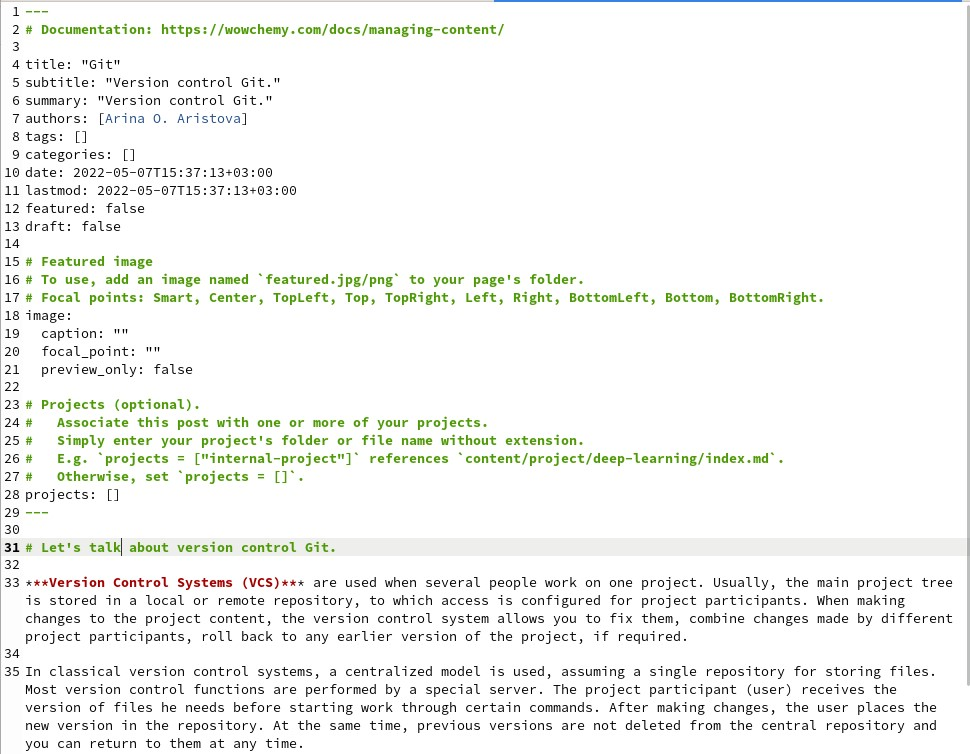{ #fig:008 width=50% }

## Выполнение работы 

Затем я проверяю изменения на локальном сайте:

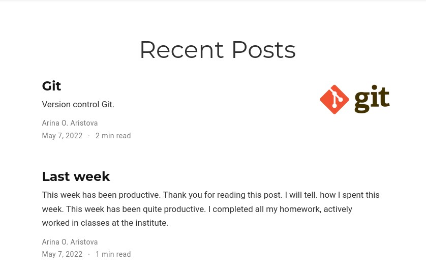{ #fig:008 width=70% }

## Выполнение работы 

Далее я выполняю ~/bin/hugo:
 
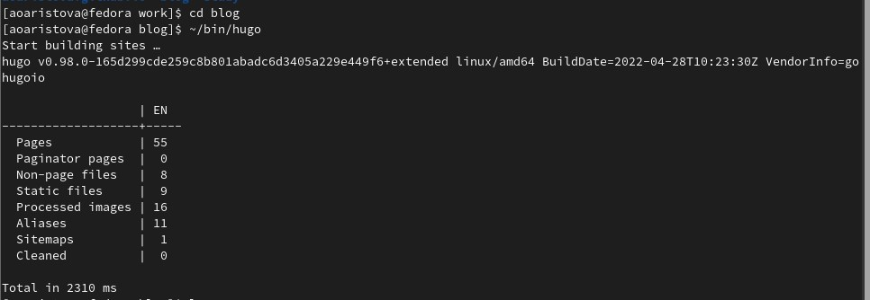{ #fig:009 width=70% }

## Выполнение работы 

И отправляю изменения на сервер:

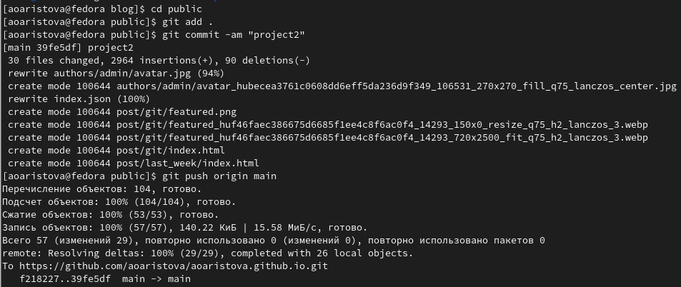{ #fig:010 width=70% }

## Выполнение работы 
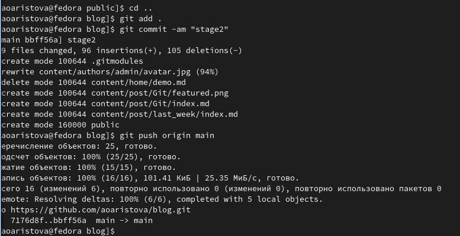{ #fig:011 width=70% }

## Выполнение работы 

Затем я проверяю публичный сайт. Убеждаюсь, что все выполнилось корректно: 

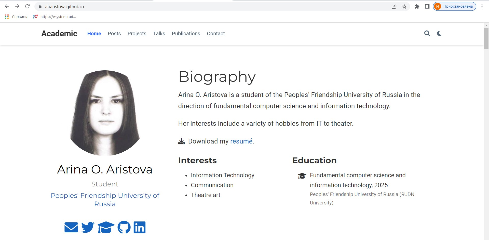{ #fig:012 width=70% }

## Выполнение работы 

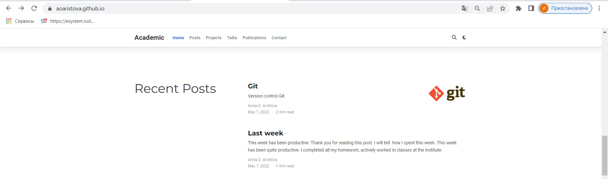{ #fig:013 width=70% }

## Выполнение работы 

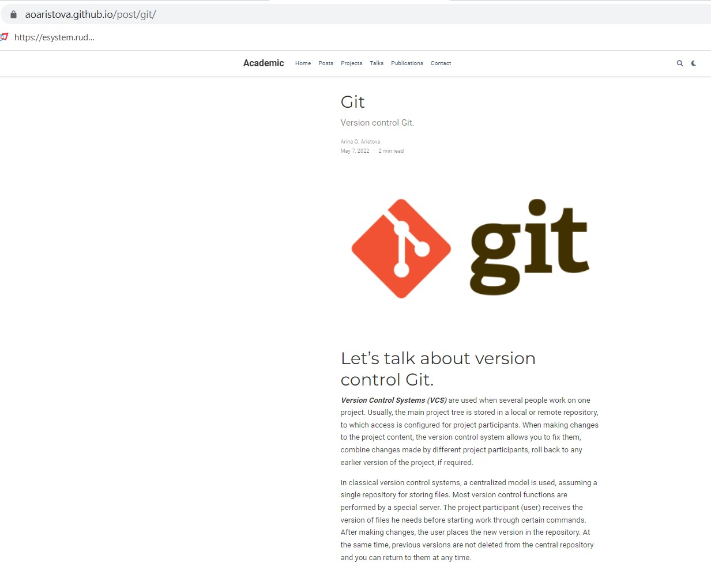{ #fig:014 width=70% }

## Вывод
В ходе выполнения второго этапа индивидуального проекта я добавила к сайту данные о себе, а также разместила несколько постов.
