---
# Front matter
lang: ru-RU
title: "Индивидуальный проект"
subtitle: "Этап 2"
author: "Арина Олеговна Аристова"

# Formatting
toc-title: "Содержание"
toc: true # Table of contents
toc_depth: 2
fontsize: 12pt
linestretch: 1.5
papersize: a4paper
documentclass: scrreprt
polyglossia-lang: russian
polyglossia-otherlangs: english
mainfont: PT Serif
romanfont: PT Serif
sansfont: PT Sans
monofont: PT Mono
mainfontoptions: Ligatures=TeX
romanfontoptions: Ligatures=TeX
sansfontoptions: Ligatures=TeX,Scale=MatchLowercase
monofontoptions: Scale=MatchLowercase
indent: true
pdf-engine: lualatex
header-includes:
  - \linepenalty=10 # the penalty added to the badness of each line within a paragraph (no associated penalty node) Increasing the value makes tex try to have fewer lines in the paragraph.
  - \interlinepenalty=0 # value of the penalty (node) added after each line of a paragraph.
  - \hyphenpenalty=50 # the penalty for line breaking at an automatically inserted hyphen
  - \exhyphenpenalty=50 # the penalty for line breaking at an explicit hyphen
  - \binoppenalty=700 # the penalty for breaking a line at a binary operator
  - \relpenalty=500 # the penalty for breaking a line at a relation
  - \clubpenalty=150 # extra penalty for breaking after first line of a paragraph
  - \widowpenalty=150 # extra penalty for breaking before last line of a paragraph
  - \displaywidowpenalty=50 # extra penalty for breaking before last line before a display math
  - \brokenpenalty=100 # extra penalty for page breaking after a hyphenated line
  - \predisplaypenalty=10000 # penalty for breaking before a display
  - \postdisplaypenalty=0 # penalty for breaking after a display
  - \floatingpenalty = 20000 # penalty for splitting an insertion (can only be split footnote in standard LaTeX)
  - \raggedbottom # or \flushbottom
  - \usepackage{float} # keep figures where there are in the text
  - \floatplacement{figure}{H} # keep figures where there are in the text
---

# Цель работы

Добавить к сайту данные о себе, а также разместить несколько постов.

# Задание

Разместить фотографию владельца сайта.

Разместить краткое описание владельца сайта (Biography).

Добавить информацию об интересах (Interests).

Добавить информацию об образовании (Education).

Сделать пост по прошедшей неделе.

Добавить пост на тему по выбору:

       - Управление версиями. Git.
       
       - Непрерывная интеграция и непрерывное развертывание (CI/CD).
       
# Выполнение работы

1. Размещаю фотографию владельца сайта, для этого заменяю фото из шаблона на свое:

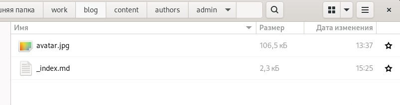{ #fig:001 width=70% }

2. Размещаю основную информацию: мое имя, название университета и ссылка на сайт:

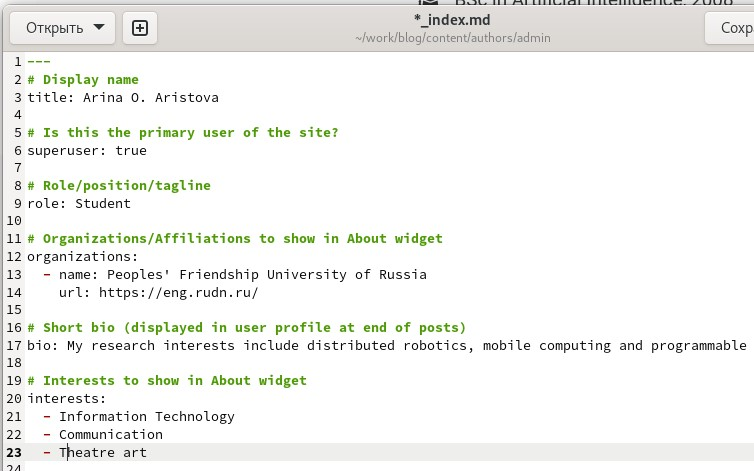{ #fig:002 width=70% }

Размещаю краткое описание владельца сайта (Biography): 

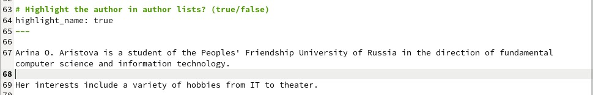{ #fig:003 width=70% }

Добавляю информацию об интересах (Interests)и об образовании (Education):

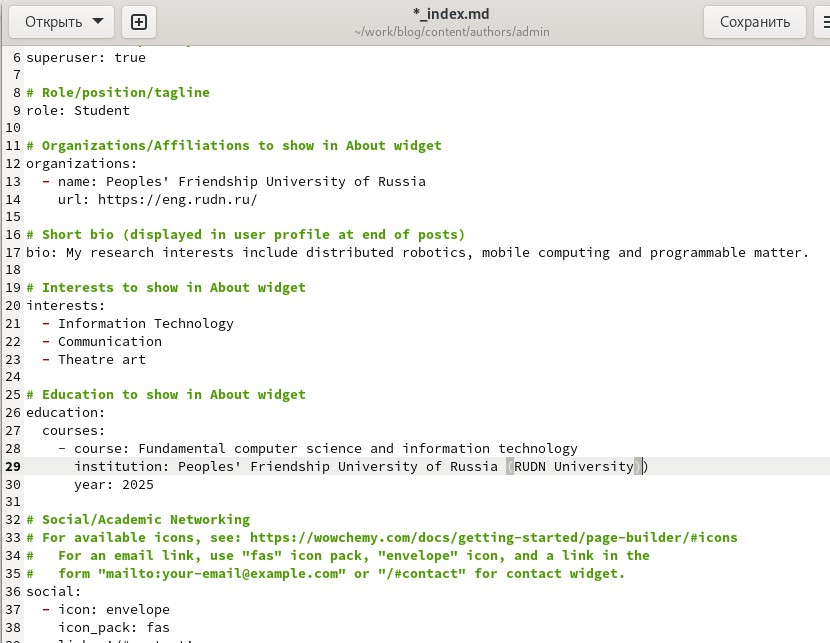{ #fig:004 width=70% }

Получив ссылку на локальный сайт с помощью ~/bin/hugo server, проверяю изменения содержимого:

{ #fig:005 width=70% }

3. Создаю пост о прошедшей неделе, размещая необходимую информацию:

Для этого выполняю команду ~/bin/hugo new post/last_week и заполняю пост информацией:

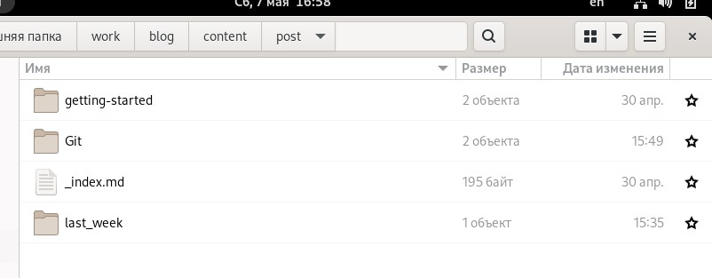{ #fig:006 width=70% }

{ #fig:007 width=70% }

4. Затем создаю пост на тему “Управление версиями. Git”:

Аналогично пункту 3 выполняю команду ~/bin/hugo new post/Git и заполняю пост информацией, к этому посту я добавила также изображение:

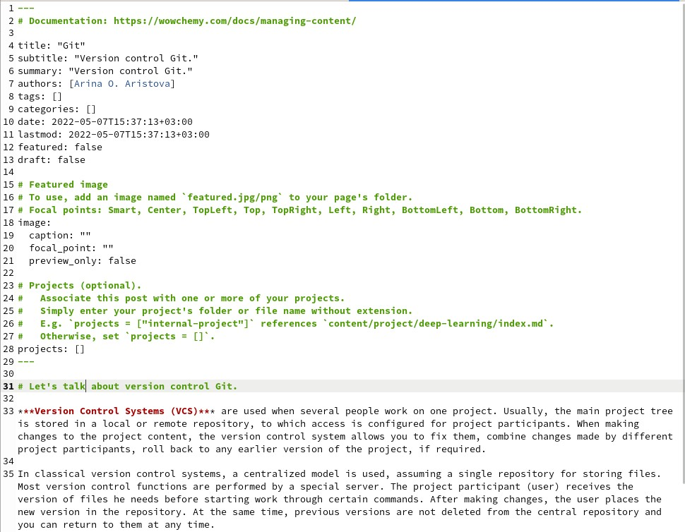{ #fig:008 width=70% }

Затем я проверяю изменения на локальном сайте:

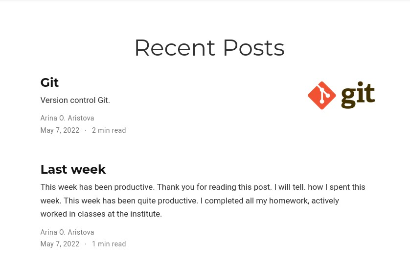{ #fig:009 width=70% }

Далее я выполняю ~/bin/hugo. И отправляю изменения на сервер:

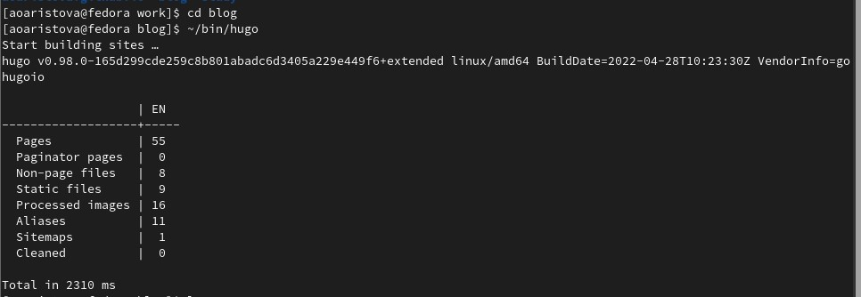{ #fig:010 width=70% }

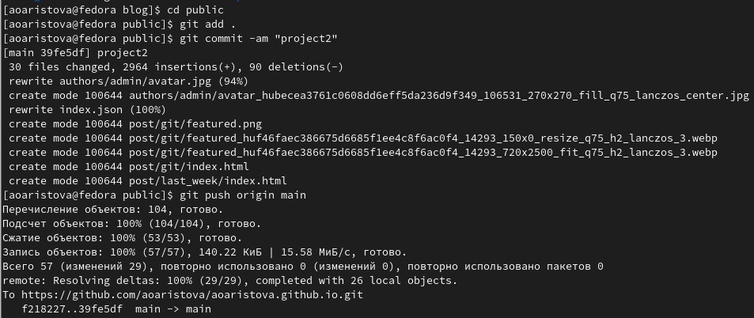{ #fig:011 width=70% }

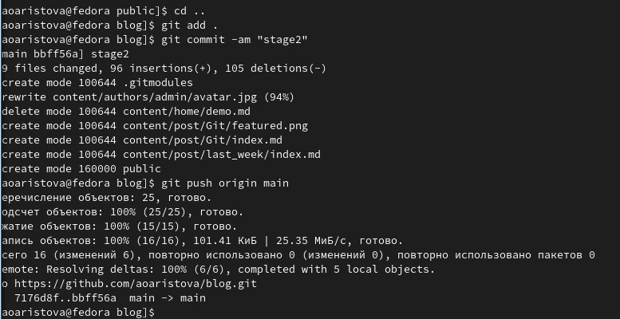{ #fig:012 width=70% }

Затем я проверяю публичный сайт. Убеждаюсь, что все выполнилось корректно: 

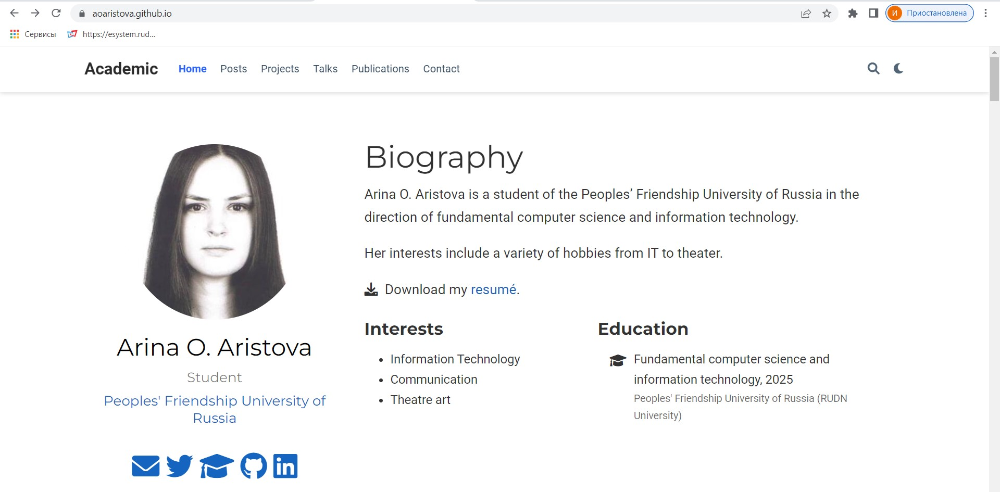{ #fig:013 width=70% }

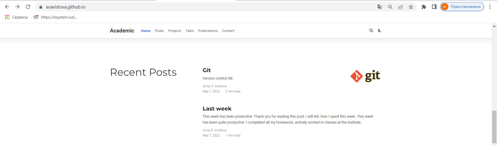{ #fig:014 width=70% }

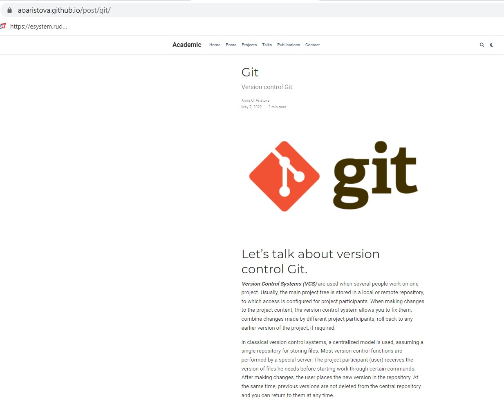{ #fig:015 width=70% }

# Вывод

В ходе выполнения второго этапа индивидуального проекта я добавила к сайту данные о себе, а также разместила несколько постов. 
