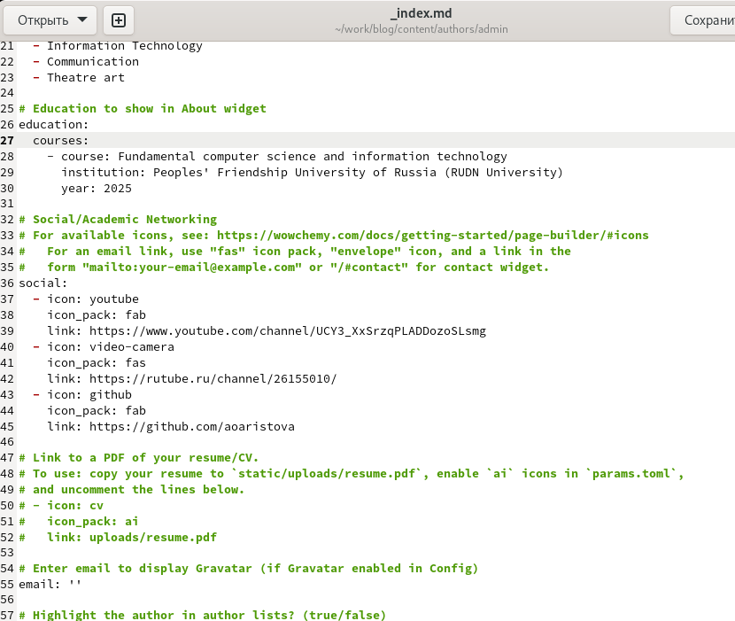
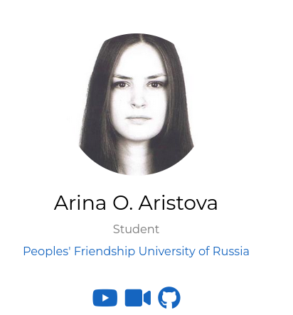
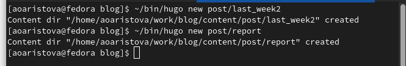
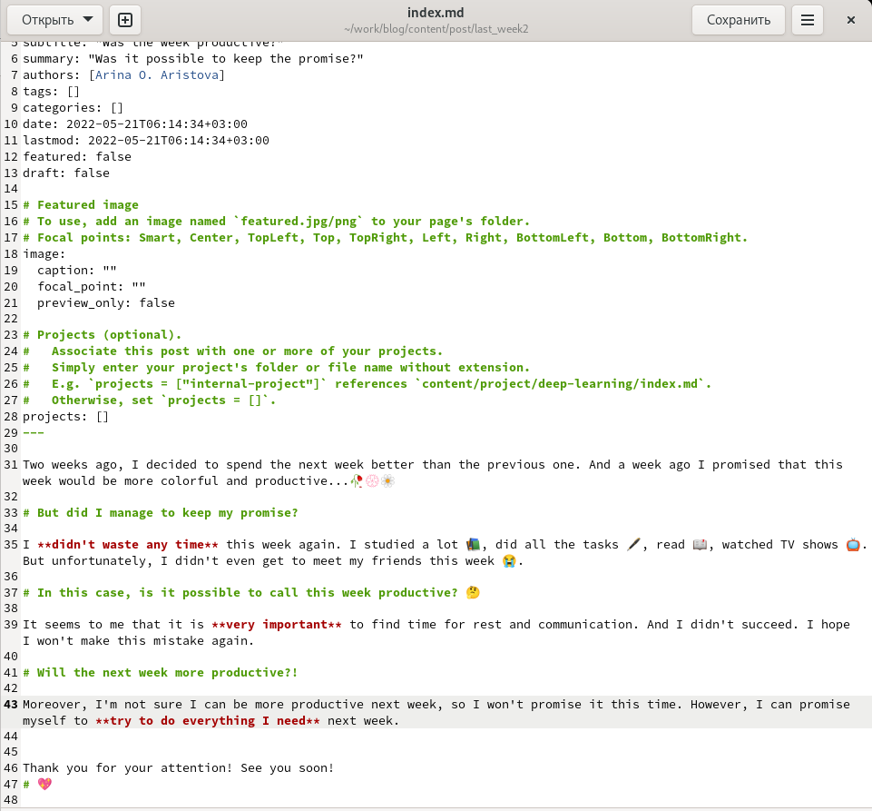
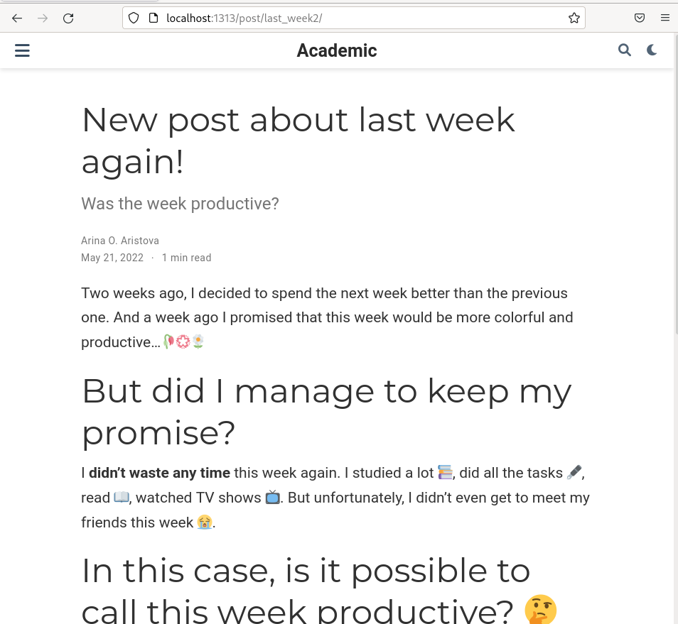
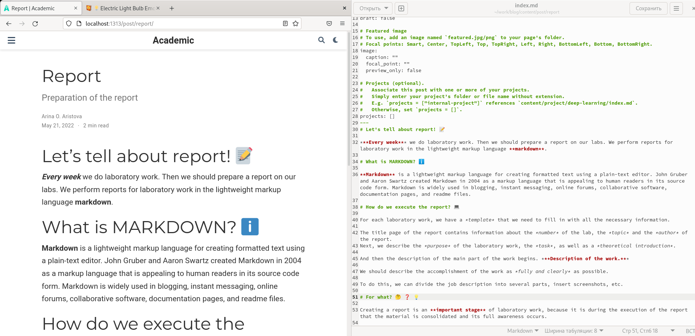
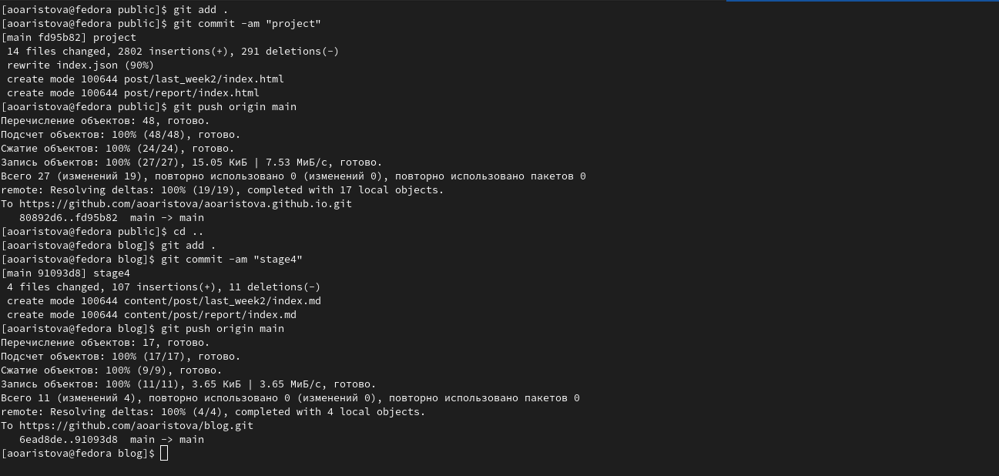
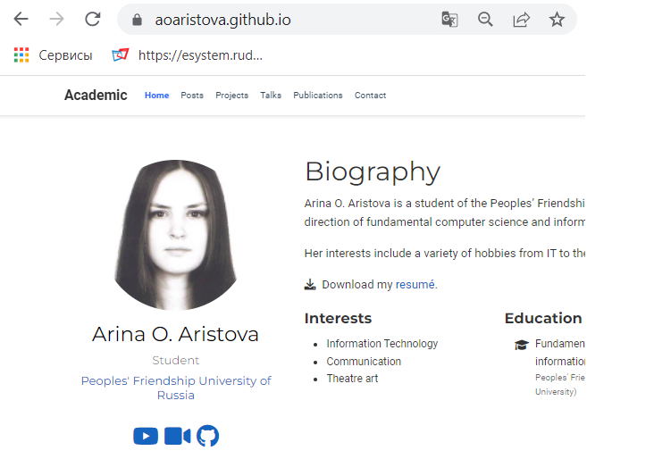

---
## Front matter
lang: ru-RU
title: Индивидуальный проект
subtitle: Этап 4
author: A.O. Aristova
institute: |
	RUDN University, Moscow, Russian Federation
date: 2022, 21 May

## Formatting
toc: false
slide_level: 2
theme: metropolis
header-includes: 
 - \metroset{progressbar=frametitle,sectionpage=progressbar,numbering=fraction}
 - '\makeatletter'
 - '\beamer@ignorenonframefalse'
 - '\makeatother'
aspectratio: 43
section-titles: true
---

## Цель работы

Добавить к сайту данные о собственных ресурсах и сделать несколько постов.

## Задание

Разместить ссылки на собственные ресурсы.

Сделать пост по прошедшей неделе.

Добавить пост на тему по выбору:

- Оформление отчёта.

- Создание презентаций.

- Работа с библиографией.

## Выполнение

Выполняю команду ~/bin/hugo server чтобы получить ссылку на локальный сайт, на котором буду отслеживать все изменения в процессе работы. 

## Выполнение

Изменяю ссылки на ресурсы: меняю иконки на подходящие и добавляю ссылки на мои ресурсы.

{ #fig:001 width=60% }

## Выполнение

Просматриваю изменения на локальном сайте.

{ #fig:002 width=50% }

## Выполнение

Приступаю к созданию постов: 

С помощью команды ~/bin/hugo new post/название_поста создаю два поста: о прошлой неделе и на тему по выбору (про оформление отчета).

{ #fig:003 width=70% }

## Выполнение

Заполняю пост о прошедшей неделе всей необходимой информацией:
указываю заголовок, подзаголовок, автора и т.д.

{ #fig:004 width=50% }

## Выполнение

Далее проверяю на локальном сайте все изменения. 

{ #fig:005 width=60% }

## Выполнение

Далее приступаю к заполнению второго поста. Этот пост на тему оформления отчета. Я также указываю заголовок, подзаголовок, автора и т.д. А затем проверяю изменения на локальном сайте.

{ #fig:006 width=60% }

## Выполнение

Затем выполняю ~/bin/hugo, выполняю команду git status, чтобы убедиться, что произошли необходимые изменения, убеждаюсь в этом и отправляю изменения на сервер. 

{ #fig:007 width=70% }

## Выполнение

Затем проверяю изменения на публичном сайте, убеждаюсь, что все выполнено корректно.

{ #fig:008 width=70% }

## Вывод

В ходе выполнения четвертого этапа индивидуально проекта я разместила на сайте ссылки на ресурсы и выложила несколько постов.

