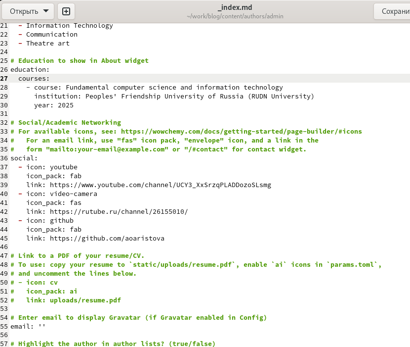
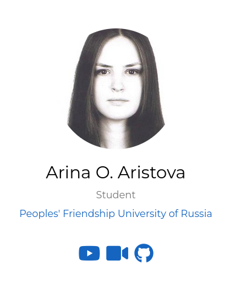
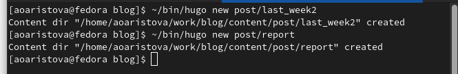
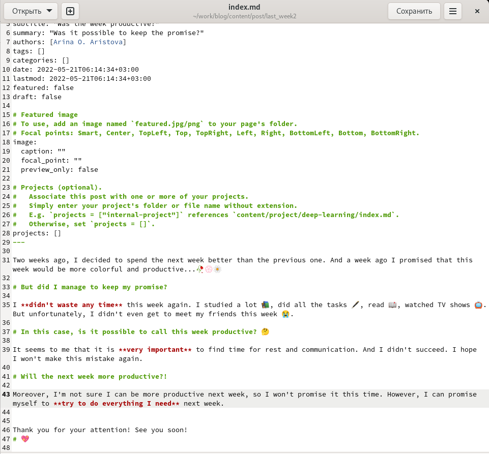
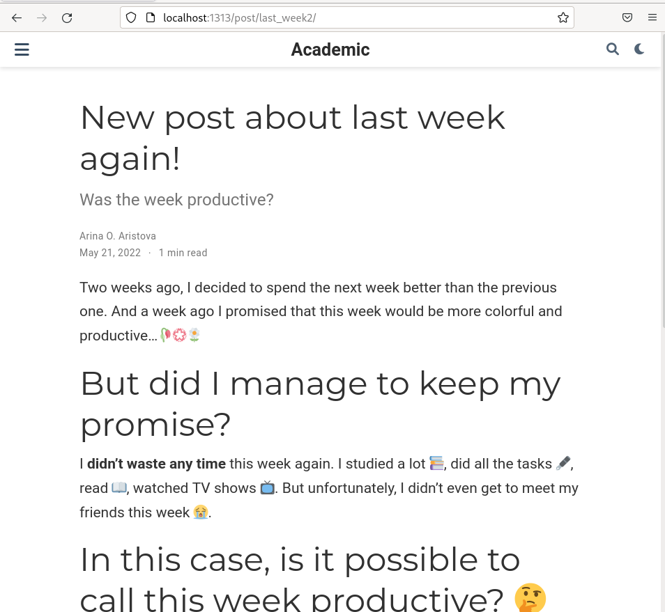
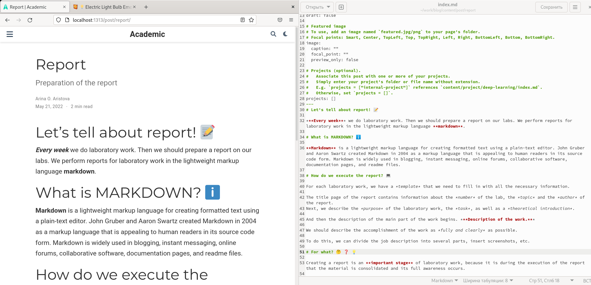
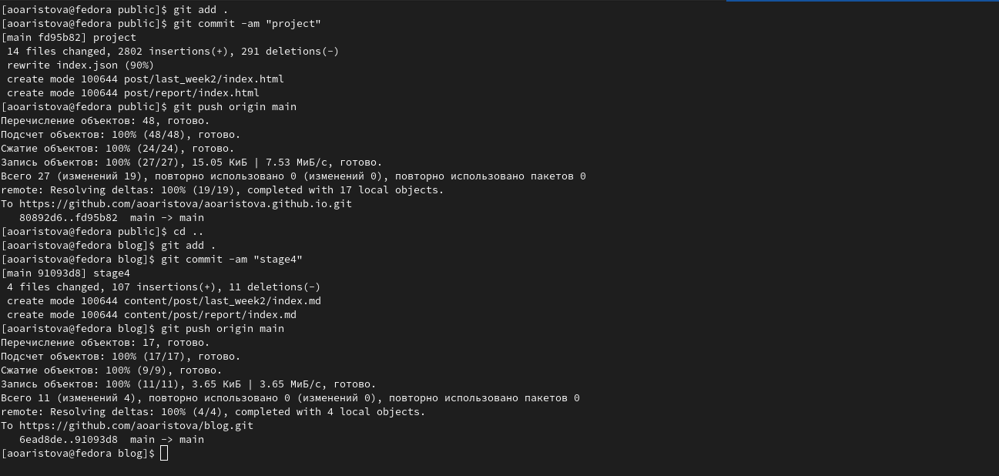
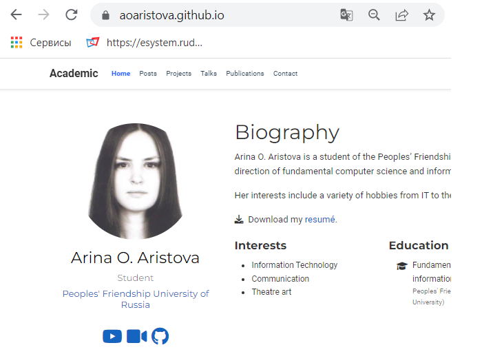

---
# Front matter
lang: ru-RU
title: "Индивидуальный проект"
subtitle: "Этап 4"
author: "Арина Олеговна Аристова"

# Formatting
toc-title: "Содержание"
toc: true # Table of contents
toc_depth: 2
fontsize: 12pt
linestretch: 1.5
papersize: a4paper
documentclass: scrreprt
polyglossia-lang: russian
polyglossia-otherlangs: english
mainfont: PT Serif
romanfont: PT Serif
sansfont: PT Sans
monofont: PT Mono
mainfontoptions: Ligatures=TeX
romanfontoptions: Ligatures=TeX
sansfontoptions: Ligatures=TeX,Scale=MatchLowercase
monofontoptions: Scale=MatchLowercase
indent: true
pdf-engine: lualatex
header-includes:
  - \linepenalty=10 # the penalty added to the badness of each line within a paragraph (no associated penalty node) Increasing the value makes tex try to have fewer lines in the paragraph.
  - \interlinepenalty=0 # value of the penalty (node) added after each line of a paragraph.
  - \hyphenpenalty=50 # the penalty for line breaking at an automatically inserted hyphen
  - \exhyphenpenalty=50 # the penalty for line breaking at an explicit hyphen
  - \binoppenalty=700 # the penalty for breaking a line at a binary operator
  - \relpenalty=500 # the penalty for breaking a line at a relation
  - \clubpenalty=150 # extra penalty for breaking after first line of a paragraph
  - \widowpenalty=150 # extra penalty for breaking before last line of a paragraph
  - \displaywidowpenalty=50 # extra penalty for breaking before last line before a display math
  - \brokenpenalty=100 # extra penalty for page breaking after a hyphenated line
  - \predisplaypenalty=10000 # penalty for breaking before a display
  - \postdisplaypenalty=0 # penalty for breaking after a display
  - \floatingpenalty = 20000 # penalty for splitting an insertion (can only be split footnote in standard LaTeX)
  - \raggedbottom # or \flushbottom
  - \usepackage{float} # keep figures where there are in the text
  - \floatplacement{figure}{H} # keep figures where there are in the text
---

# Цель работы

Добавить к сайту данные о собственных ресурсах и сделать несколько постов.

# Задание

Разместить ссылки на собственные ресурсы.

Сделать пост по прошедшей неделе.

Добавить пост на тему по выбору:

- Оформление отчёта.

- Создание презентаций.

- Работа с библиографией.

# Выполнение

Выполняю команду ~/bin/hugo server чтобы получить ссылку на локальный сайт, на котором буду отслеживать все изменения в процессе работы. 

Изменяю ссылки на ресурсы: меняю иконки на подходящие и добавляю ссылки на мои ресурсы.

{ #fig:001 width=70% }

Просматриваю изменения на локальном сайте.

{ #fig:002 width=70% }

Приступаю к созданию постов: 

С помощью команды ~/bin/hugo new post/название_поста создаю два поста: о прошлой неделе и на тему по выбору (про оформление отчета).

{ #fig:003 width=70% }

Заполняю пост о прошедшей неделе всей необходимой информацией:
указываю заголовок, подзаголовок, автора и т.д.

{ #fig:004 width=70% }

Далее проверяю на локальном сайте все изменения. 

{ #fig:005 width=70% }

Далее приступаю к заполнению второго поста. Этот пост на тему оформления отчета. Я также указываю заголовок, подзаголовок, автора и т.д. А затем проверяю изменения на локальном сайте.

{ #fig:006 width=70% }

Затем выполняю ~/bin/hugo, выполняю команду git status, чтобы убедиться, что произошли необходимые изменения, убеждаюсь в этом и отправляю изменения на сервер. 

{ #fig:007 width=70% }

Затем проверяю изменения на публичном сайте, убеждаюсь, что все выполнено корректно.

{ #fig:008 width=70% }

# Вывод

В ходе выполнения четвертого этапа индивидуально проекта я разместила на сайте ссылки на ресурсы и выложила несколько постов.
